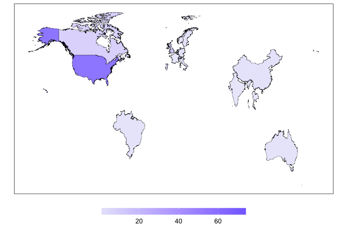
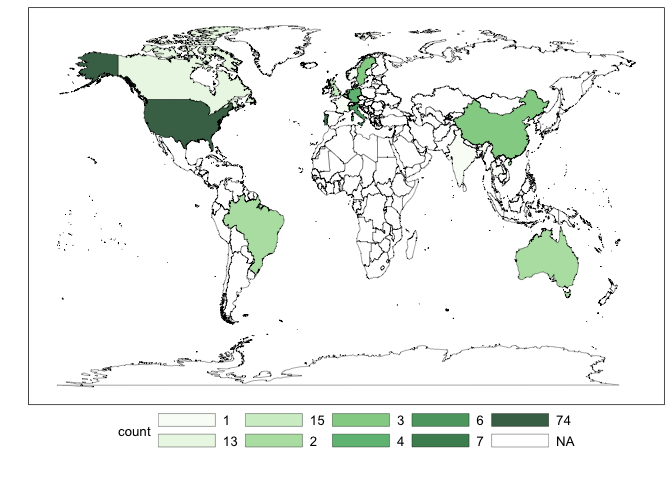

Cleaning Script
================

# Package Loading

``` r
library(tidyverse)
```

    ## ── Attaching core tidyverse packages ──────────────────────── tidyverse 2.0.0 ──
    ## ✔ dplyr     1.1.4     ✔ readr     2.1.5
    ## ✔ forcats   1.0.0     ✔ stringr   1.5.1
    ## ✔ ggplot2   3.5.1     ✔ tibble    3.2.1
    ## ✔ lubridate 1.9.3     ✔ tidyr     1.3.1
    ## ✔ purrr     1.0.2     
    ## ── Conflicts ────────────────────────────────────────── tidyverse_conflicts() ──
    ## ✖ dplyr::filter() masks stats::filter()
    ## ✖ dplyr::lag()    masks stats::lag()
    ## ℹ Use the conflicted package (<http://conflicted.r-lib.org/>) to force all conflicts to become errors

``` r
library(maps)
```

    ## 
    ## Attaching package: 'maps'
    ## 
    ## The following object is masked from 'package:purrr':
    ## 
    ##     map

# Data Loading

``` r
stakeholder_survey <- read.csv("/Users/kenjinchang/github/scr-and-stakeholder-analysis/data/survey-data.csv")
review_data <- read.csv("/Users/kenjinchang/github/scr-and-stakeholder-analysis/data/review-data.csv")
```

# Cleaning

First, we will need to select and rename the variables relevant to our
plan of analysis. We will specifically focus on the following:

- `date`, which corresponds to the date and time the response was
  recorded
- `completion`, which corresponds to the proportion of the survey that
  was completed
- `channel`, which corresponds to the means through which the survey
  materials were accessed
- `consent`, which corresponds to whether participants provided informed
  consent
- `involvement`, which corresponds to the participants’ self-reported
  role in deciding dining policies and practices
- `involvement_other`, which corresponds to to offered clarifications on
  participants’ reported roles in deciding dining policies and practices
- `stakeholder_type`, which corresponds to the type of professional role
  participants reported as serving
- `stakeholder_type_other`, which corresponds to offered clarifications
  on the type of professional role participants reported as serving
- `title`, which corresponds to participants’ disclosed job titles
- `role_duration`, which corresponds to the number of years participants
  have served in that position
- `dietary_health_ranking`, which corresponds to the level of priority
  given to the healthiness of food offerings
- `dietary_sustainability_ranking`, which corresponds to the level of
  priority given to the sustainability of guest food choices
- `institutional_sustainability_ranking`, which corresponds to the level
  of priority given to the sustainability of dining operations
- `food_pricing_ranking`, which corresponds to the level of priority
  given to the campus food prices
- `operational_costs_ranking`, which corresponds to the level of
  priority given to cost of funding dining operations
- `guest_satisfaction_ranking`, which corresponds to the level of
  priority given to the dining experiences of students
- `worker_satisfaction_ranking`, which corresponds to the level of
  priority given to the labor experiences of dining staff
- `campus_culture_ranking`, which corresponds to the level of priority
  given to campus sustainability culture and the monitoring of spillover
  effects
- `other_ranking`, which corresponds to the level of priority given to
  other relevant indicators of university-based dietary intervention
  performance not considered in the provided list
- `other_ranking_other`, which corresponds to offered indicators

``` r
stakeholder_survey <- stakeholder_survey %>%
  select(RecordedDate,Progress,DistributionChannel,Q1,Q2,Q2_4_TEXT,Q6,Q6_10_TEXT,Q3,Q5_1,Q2_1,Q2_2,Q2_3,Q2_4,Q2_5,Q2_6,Q2_7,Q2_8,Q2_9,Q2_9_TEXT) %>%
  rename(date=RecordedDate,completion=Progress,channel=DistributionChannel,consent=Q1,involvement=Q2,involvement_other=Q2_4_TEXT,stakeholder_type=Q6,stakeholder_type_other=Q6_10_TEXT,title=Q3,role_duration=Q5_1,dietary_health_ranking=Q2_1,dietary_sustainability_ranking=Q2_2,institutional_sustainability_ranking=Q2_3,food_pricing_ranking=Q2_4,operational_costs_ranking=Q2_5,guest_satisfaction_ranking=Q2_6,worker_satisfaction_ranking=Q2_7,campus_culture_ranking=Q2_8,other_ranking=Q2_9,other_ranking_other=Q2_9_TEXT) 
```

We also need to (1) omit the first three rows, which contain information
about how the survey variables are coded and (2) reclass the
`dietary_health_ranking`, `dietary_sustainability_ranking`,
`institutional_sustainability_ranking`, `food_price_ranking`,
`operational_costs_ranking`, `guest_satisfaction_ranking`,
`worker_satisfaction_ranking`, `campus_culure_ranking`, and
`other_ranking` variables from characteric strings to numeric vectors.

``` r
stakeholder_survey <- stakeholder_survey %>%
  slice(3:n()) %>%
  mutate(dietary_health_ranking=as.numeric(dietary_health_ranking)) %>%
  mutate(dietary_sustainability_ranking=as.numeric(dietary_sustainability_ranking)) %>%
  mutate(institutional_sustainability_ranking=as.numeric(institutional_sustainability_ranking)) %>%
  mutate(food_pricing_ranking=as.numeric(food_pricing_ranking)) %>%
  mutate(operational_costs_ranking=as.numeric(operational_costs_ranking)) %>%
  mutate(guest_satisfaction_ranking=as.numeric(guest_satisfaction_ranking)) %>%
  mutate(worker_satisfaction_ranking=as.numeric(worker_satisfaction_ranking)) %>%
  mutate(campus_culture_ranking=as.numeric(campus_culture_ranking)) %>%
  mutate(other_ranking=as.numeric(other_ranking)) 
```

With this complete, we can now move on to address an isolated difference
in how one subject elected to respond to the rank-order choice set. More
specifically, this participant used the provided prompt to suggest an
unlisted performance indicator in `other_ranking_other`, with all other
respondents ranking `other_ranking` last and without any additional
details. Given this, in the interest of constructing a consistent
scoring system, we will narratively note the omission of the suggested
“Cuisine type” indicator in our results while simultaneously removing
the `other_ranking` and `other_ranking_other` variables from the
variable list.

In this particular instance, because the subject identified this
previously unspecified indicator with a rank of “2,” this requires us to
subtract 1 from every ranked indicator apart from
`guest_satisfaction_ranking`, which was ranked first, ahead of “Cuisine
type.”

To accomplish this, we will first transform the data by adding variable
`id` to attach unique identifiers to each individual response. This will
help us isolate the changes in ranking to the one outlying response set.

``` r
stakeholder_survey <- stakeholder_survey %>%
  mutate(id=row_number())
```

Now, we move on to the next step, which involves recoding all rank
responses greater than “2,” such that every performance indicator apart
from `guest_satisfaction_ranking` moves one position ahead to compensate
for the joint removal of `other_ranking` and `other_ranking_other`.

``` r
stakeholder_survey <- stakeholder_survey %>%
  mutate(campus_culture_ranking=case_when(id == 22 ~ 8,
                                          TRUE ~ campus_culture_ranking)) %>%
  mutate(worker_satisfaction_ranking=case_when(id == 22 ~ 7,
                                          TRUE ~ worker_satisfaction_ranking)) %>%
  mutate(operational_costs_ranking=case_when(id == 22 ~ 2,
                                          TRUE ~ worker_satisfaction_ranking)) %>%
  mutate(food_pricing_ranking=case_when(id == 22 ~ 3,
                                          TRUE ~ food_pricing_ranking)) %>%
  mutate(institutional_sustainability_ranking=case_when(id == 22 ~ 4,
                                          TRUE ~ institutional_sustainability_ranking)) %>%
  mutate(dietary_sustainability_ranking=case_when(id == 22 ~ 5,
                                          TRUE ~ dietary_sustainability_ranking)) %>%
  mutate(dietary_health_ranking=case_when(id == 22 ~ 6,
                                          TRUE ~ dietary_health_ranking)) 
```

With

``` r
stakeholder_survey %>% select(-other_ranking,-other_ranking_other)
```

    ##                   date completion channel               consent
    ## 1  2024-10-02 12:42:10        100      qr I wish to participate
    ## 2  2024-10-02 12:42:13        100      qr I wish to participate
    ## 3  2024-10-02 12:42:20        100      qr I wish to participate
    ## 4  2024-10-02 12:42:26        100      qr I wish to participate
    ## 5  2024-10-02 12:42:29        100      qr I wish to participate
    ## 6  2024-10-02 12:42:32        100      qr I wish to participate
    ## 7  2024-10-02 12:42:37        100      qr I wish to participate
    ## 8  2024-10-02 12:42:41        100      qr I wish to participate
    ## 9  2024-10-02 12:42:51        100      qr I wish to participate
    ## 10 2024-10-02 12:42:54        100      qr I wish to participate
    ## 11 2024-10-02 12:42:57        100      qr I wish to participate
    ## 12 2024-10-02 12:42:58        100      qr I wish to participate
    ## 13 2024-10-02 12:43:05        100      qr I wish to participate
    ## 14 2024-10-02 12:43:06        100      qr I wish to participate
    ## 15 2024-10-02 12:43:09        100      qr I wish to participate
    ## 16 2024-10-02 12:43:11        100      qr I wish to participate
    ## 17 2024-10-02 12:43:16        100      qr I wish to participate
    ## 18 2024-10-02 12:43:18        100      qr I wish to participate
    ## 19 2024-10-02 12:43:20        100      qr I wish to participate
    ## 20 2024-10-02 12:43:21        100      qr I wish to participate
    ## 21 2024-10-02 12:43:30        100      qr I wish to participate
    ## 22 2024-10-02 12:43:38        100      qr I wish to participate
    ## 23 2024-10-02 12:43:52        100      qr I wish to participate
    ## 24 2024-10-02 12:44:02        100      qr I wish to participate
    ## 25 2024-10-02 12:44:04        100      qr I wish to participate
    ## 26 2024-10-02 12:44:16        100      qr I wish to participate
    ## 27 2024-10-02 12:44:22        100      qr I wish to participate
    ## 28 2024-10-02 12:44:39        100      qr I wish to participate
    ## 29 2024-10-02 12:44:43        100      qr I wish to participate
    ## 30 2024-10-02 12:44:44        100      qr I wish to participate
    ## 31 2024-10-02 14:20:00        100      qr I wish to participate
    ## 32 2024-10-04 07:14:22        100      qr I wish to participate
    ##                              involvement
    ## 1            I consult on best practices
    ## 2            I consult on best practices
    ## 3                Other (please specify):
    ## 4          I am a primary decision maker
    ## 5          I am a primary decision maker
    ## 6          I am a primary decision maker
    ## 7          I am a primary decision maker
    ## 8            I consult on best practices
    ## 9            I consult on best practices
    ## 10         I am a primary decision maker
    ## 11           I consult on best practices
    ## 12         I am a primary decision maker
    ## 13           I consult on best practices
    ## 14         I am a primary decision maker
    ## 15           I consult on best practices
    ## 16           I consult on best practices
    ## 17           I consult on best practices
    ## 18         I am a primary decision maker
    ## 19           I consult on best practices
    ## 20 I offer feedback on existing services
    ## 21         I am a primary decision maker
    ## 22         I am a primary decision maker
    ## 23           I consult on best practices
    ## 24           I consult on best practices
    ## 25 I offer feedback on existing services
    ## 26           I consult on best practices
    ## 27         I am a primary decision maker
    ## 28           I consult on best practices
    ## 29           I consult on best practices
    ## 30           I consult on best practices
    ## 31         I am a primary decision maker
    ## 32 I offer feedback on existing services
    ##                                                                   involvement_other
    ## 1                                                                                  
    ## 2                                                                                  
    ## 3  Collaboration and influence with corporate stakeholders on food loss and waste  
    ## 4                                                                                  
    ## 5                                                                                  
    ## 6                                                                                  
    ## 7                                                                                  
    ## 8                                                                                  
    ## 9                                                                                  
    ## 10                                                                                 
    ## 11                                                                                 
    ## 12                                                                                 
    ## 13                                                                                 
    ## 14                                                                                 
    ## 15                                                                                 
    ## 16                                                                                 
    ## 17                                                                                 
    ## 18                                                                                 
    ## 19                                                                                 
    ## 20                                                                                 
    ## 21                                                                                 
    ## 22                                                                                 
    ## 23                                                                                 
    ## 24                                                                                 
    ## 25                                                                                 
    ## 26                                                                                 
    ## 27                                                                                 
    ## 28                                                                                 
    ## 29                                                                                 
    ## 30                                                                                 
    ## 31                                                                                 
    ## 32                                                                                 
    ##              stakeholder_type         stakeholder_type_other
    ## 1        Nutrition specialist                               
    ## 2  Sustainability coordinator                               
    ## 3     Other (please specify):                   NGO employee
    ## 4             Dining director                               
    ## 5             Dining director                               
    ## 6                        Chef                               
    ## 7             Dining director                               
    ## 8  Sustainability coordinator                               
    ## 9        Nutrition specialist                               
    ## 10            Dining director                               
    ## 11    Other (please specify):                       Advisor 
    ## 12                       Chef                               
    ## 13       Nutrition specialist                               
    ## 14   University administrator                               
    ## 15 Sustainability coordinator                               
    ## 16                       Chef                               
    ## 17   University administrator                               
    ## 18   University administrator                               
    ## 19    Other (please specify):             Dining management 
    ## 20                       Chef                               
    ## 21            Dining director                               
    ## 22   University administrator                               
    ## 23       Nutrition specialist                               
    ## 24 Sustainability coordinator                               
    ## 25       Nutrition specialist                               
    ## 26 Sustainability coordinator                               
    ## 27 Sustainability coordinator                               
    ## 28            Dining director                               
    ## 29    Other (please specify): Manager of residential dining 
    ## 30    Other (please specify):              Dining marketing 
    ## 31            Dining director                               
    ## 32    Other (please specify):                      marketing
    ##                                                                          title
    ## 1                                                                             
    ## 2                                                      Sustainability Manager 
    ## 3                                                 Associate Program Specialist
    ## 4                                                                     Director
    ## 5                                                           Director of Dining
    ## 6                                                        Campus Executive Chef
    ## 7                                                           Director of Dining
    ## 8                                                     Sustainability Director 
    ## 9                                                                    Dietitian
    ## 10                                          Senior Director of Dining Services
    ## 11                                                                            
    ## 12 Senior associate Director culinary strategies and plant forward experience 
    ## 13                                                   Nutrition Systems Manager
    ## 14                                                   Assistant Vice President 
    ## 15                                                      Sustainability Manager
    ## 16                                                              Executive chef
    ## 17                                                                         AVP
    ## 18                                                  Associate Vice Chancellor 
    ## 19                              Director of Culinary development and nutrition
    ## 20                                                                 Sous Chef/s
    ## 21                                                  Executive Director dining 
    ## 22                                                          Asst. Vice Provost
    ## 23                                                                   Dietitian
    ## 24                                                                            
    ## 25                                                        Registered Dietitian
    ## 26                                                  Director of sustainability
    ## 27                                             Regional Sustainability Manager
    ## 28                                       Associate Director, Food and beverage
    ## 29                                                       Halls cluster manger 
    ## 30                                                          Marketing manager 
    ## 31                                                            Dining Director 
    ## 32                                                                            
    ##    role_duration dietary_health_ranking dietary_sustainability_ranking
    ## 1              2                      2                              3
    ## 2              1                      2                              3
    ## 3              2                      3                              4
    ## 4              1                      2                              5
    ## 5             11                      8                              5
    ## 6              3                      8                              3
    ## 7              1                      1                              2
    ## 8      5.5 years                      6                              5
    ## 9              3                      2                              5
    ## 10            32                      4                              2
    ## 11             1                      7                              3
    ## 12             3                      1                              6
    ## 13            12                      6                              7
    ## 14             2                      1                              8
    ## 15             3                      4                              5
    ## 16             3                      6                              4
    ## 17      20 years                      3                              6
    ## 18             4                      4                              8
    ## 19             2                      1                              4
    ## 20             1                      5                              6
    ## 21             2                      5                              2
    ## 22            16                      6                              5
    ## 23             3                      1                              2
    ## 24            .1                      6                              2
    ## 25             3                      2                              5
    ## 26            10                      3                              5
    ## 27             2                      6                              5
    ## 28             5                      5                              8
    ## 29             2                      3                              5
    ## 30             3                      2                              4
    ## 31             3                      5                              6
    ## 32                                    3                              6
    ##    institutional_sustainability_ranking food_pricing_ranking
    ## 1                                     7                    5
    ## 2                                     1                    8
    ## 3                                     8                    2
    ## 4                                     6                    4
    ## 5                                     7                    1
    ## 6                                     6                    2
    ## 7                                     3                    5
    ## 8                                     4                    8
    ## 9                                     7                    8
    ## 10                                    1                    7
    ## 11                                    8                    5
    ## 12                                    8                    4
    ## 13                                    5                    3
    ## 14                                    5                    6
    ## 15                                    1                    6
    ## 16                                    8                    2
    ## 17                                    8                    1
    ## 18                                    7                    3
    ## 19                                    8                    6
    ## 20                                    4                    8
    ## 21                                    3                    7
    ## 22                                    4                    3
    ## 23                                    6                    8
    ## 24                                    1                    5
    ## 25                                    6                    3
    ## 26                                    1                    6
    ## 27                                    4                    2
    ## 28                                    6                    1
    ## 29                                    4                    7
    ## 30                                    3                    6
    ## 31                                    7                    8
    ## 32                                    8                    2
    ##    operational_costs_ranking guest_satisfaction_ranking
    ## 1                          6                          1
    ## 2                          5                          4
    ## 3                          7                          6
    ## 4                          7                          1
    ## 5                          2                          4
    ## 6                          7                          4
    ## 7                          6                          4
    ## 8                          1                          2
    ## 9                          6                          1
    ## 10                         6                          5
    ## 11                         6                          1
    ## 12                         2                          5
    ## 13                         8                          4
    ## 14                         3                          2
    ## 15                         8                          3
    ## 16                         7                          1
    ## 17                         2                          4
    ## 18                         6                          2
    ## 19                         3                          2
    ## 20                         3                          1
    ## 21                         1                          4
    ## 22                         2                          1
    ## 23                         7                          3
    ## 24                         4                          8
    ## 25                         8                          1
    ## 26                         8                          4
    ## 27                         8                          3
    ## 28                         7                          2
    ## 29                         8                          2
    ## 30                         7                          1
    ## 31                         2                          4
    ## 32                         5                          4
    ##    worker_satisfaction_ranking campus_culture_ranking id
    ## 1                            6                      8  1
    ## 2                            5                      6  2
    ## 3                            7                      1  3
    ## 4                            7                      8  4
    ## 5                            2                      6  5
    ## 6                            7                      5  6
    ## 7                            6                      7  7
    ## 8                            1                      7  8
    ## 9                            6                      3  9
    ## 10                           6                      8 10
    ## 11                           6                      4 11
    ## 12                           2                      3 12
    ## 13                           8                      1 13
    ## 14                           3                      4 14
    ## 15                           8                      7 15
    ## 16                           7                      5 16
    ## 17                           2                      5 17
    ## 18                           6                      1 18
    ## 19                           3                      7 19
    ## 20                           3                      2 20
    ## 21                           1                      8 21
    ## 22                           7                      8 22
    ## 23                           7                      5 23
    ## 24                           4                      7 24
    ## 25                           8                      7 25
    ## 26                           8                      2 26
    ## 27                           8                      7 27
    ## 28                           7                      4 28
    ## 29                           8                      6 29
    ## 30                           7                      8 30
    ## 31                           2                      1 31
    ## 32                           5                      7 32

Inverted scoring system

``` r
stakeholder_survey <- stakeholder_survey %>%
  mutate(dietary_health_score=case_when(dietary_health_ranking == 1 ~ 8,
                                        dietary_health_ranking == 2 ~ 7,
                                        dietary_health_ranking == 3 ~ 6,
                                        dietary_health_ranking == 4 ~ 5,
                                        dietary_health_ranking == 5 ~ 4,
                                        dietary_health_ranking == 6 ~ 3,
                                        dietary_health_ranking == 7 ~ 2,
                                        dietary_health_ranking == 8 ~ 1)) %>%
  mutate(dietary_sustainability_score=case_when(dietary_sustainability_ranking == 1 ~ 8,
                                        dietary_sustainability_ranking == 2 ~ 7,
                                        dietary_sustainability_ranking == 3 ~ 6,
                                        dietary_sustainability_ranking == 4 ~ 5,
                                        dietary_sustainability_ranking == 5 ~ 4,
                                        dietary_sustainability_ranking == 6 ~ 3,
                                        dietary_sustainability_ranking == 7 ~ 2,
                                        dietary_sustainability_ranking == 8 ~ 1)) %>%
  mutate(institutional_sustainability_score=case_when(institutional_sustainability_ranking == 1 ~ 9,
                                        institutional_sustainability_ranking == 2 ~ 8,
                                        institutional_sustainability_ranking == 3 ~ 7,
                                        institutional_sustainability_ranking == 4 ~ 6,
                                        institutional_sustainability_ranking == 5 ~ 5,
                                        institutional_sustainability_ranking == 6 ~ 4,
                                        institutional_sustainability_ranking == 7 ~ 3,
                                        institutional_sustainability_ranking == 8 ~ 2,
                                        institutional_sustainability_ranking == 9 ~ 1)) %>%
  mutate(food_pricing_score=case_when(food_pricing_ranking == 1 ~ 8,
                                        food_pricing_ranking == 2 ~ 7,
                                        food_pricing_ranking == 3 ~ 6,
                                        food_pricing_ranking == 4 ~ 5,
                                        food_pricing_ranking == 5 ~ 4,
                                        food_pricing_ranking == 6 ~ 3,
                                        food_pricing_ranking == 7 ~ 2,
                                        food_pricing_ranking == 8 ~ 1)) %>%
  mutate(operational_costs_score=case_when(operational_costs_ranking == 1 ~ 8,
                                        operational_costs_ranking == 2 ~ 7,
                                        operational_costs_ranking == 3 ~ 6,
                                        operational_costs_ranking == 4 ~ 5,
                                        operational_costs_ranking == 5 ~ 4,
                                        operational_costs_ranking == 6 ~ 3,
                                        operational_costs_ranking == 7 ~ 2,
                                        operational_costs_ranking == 8 ~ 1)) %>%
  mutate(guest_satisfaction_score=case_when(guest_satisfaction_ranking == 1 ~ 8,
                                        guest_satisfaction_ranking == 2 ~ 7,
                                        guest_satisfaction_ranking == 3 ~ 6,
                                        guest_satisfaction_ranking == 4 ~ 5,
                                        guest_satisfaction_ranking == 5 ~ 4,
                                        guest_satisfaction_ranking == 6 ~ 3,
                                        guest_satisfaction_ranking == 7 ~ 2,
                                        guest_satisfaction_ranking == 8 ~ 1)) %>%
  mutate(worker_satisfaction_score=case_when(worker_satisfaction_ranking == 1 ~ 8,
                                        worker_satisfaction_ranking == 2 ~ 7,
                                        worker_satisfaction_ranking == 3 ~ 6,
                                        worker_satisfaction_ranking == 4 ~ 5,
                                        worker_satisfaction_ranking == 5 ~ 4,
                                        worker_satisfaction_ranking == 6 ~ 3,
                                        worker_satisfaction_ranking == 7 ~ 2,
                                        worker_satisfaction_ranking == 8 ~ 1)) %>%
  mutate(campus_culture_score=case_when(campus_culture_ranking == 1 ~ 8,
                                        campus_culture_ranking == 2 ~ 7,
                                        campus_culture_ranking == 3 ~ 6,
                                        campus_culture_ranking == 4 ~ 5,
                                        campus_culture_ranking == 5 ~ 4,
                                        campus_culture_ranking == 6 ~ 3,
                                        campus_culture_ranking == 7 ~ 2,
                                        campus_culture_ranking == 8 ~ 1)) 
```

``` r
stakeholder_survey %>%
  summarise(dietary_health_score_sum=sum(dietary_health_score),dietary_sustainability_score=sum(dietary_sustainability_score),institutional_sustainability_score_sum=sum(institutional_sustainability_score),food_pricing_score_sum=sum(food_pricing_score),operational_costs_score_sum=sum(operational_costs_score),guest_satisfaction_score_sum=sum(guest_satisfaction_score),worker_satisfaction_score_sum=sum(worker_satisfaction_score),campus_culture_score_sum=sum(worker_satisfaction_score),campus_culture_score_sum=sum(campus_culture_score)) 
```

    ##   dietary_health_score_sum dietary_sustainability_score
    ## 1                      165                          139
    ##   institutional_sustainability_score_sum food_pricing_score_sum
    ## 1                                    155                    136
    ##   operational_costs_score_sum guest_satisfaction_score_sum
    ## 1                         120                          194
    ##   worker_satisfaction_score_sum campus_culture_score_sum
    ## 1                           115                      120

``` r
stakeholder_survey %>%
  group_by(involvement) %>%
  summarise(dietary_health_score_mean=mean(dietary_health_score),dietary_sustainability_score_mean=mean(dietary_sustainability_score),institutional_sustainability_score_mean=mean(institutional_sustainability_score),institutional_sustainability_score_mean=mean(institutional_sustainability_score),food_pricing_score_mean=mean(food_pricing_score),operational_costs_score_mean=mean(operational_costs_score),guest_satisfaction_score_mean=mean(guest_satisfaction_score),worker_satisfaction_score_mean=mean(worker_satisfaction_score),campus_culture_score_mean=mean(campus_culture_score),n=n())
```

    ## # A tibble: 4 × 10
    ##   involvement                      dietary_health_score…¹ dietary_sustainabili…²
    ##   <chr>                                             <dbl>                  <dbl>
    ## 1 I am a primary decision maker                      4.75                   4.25
    ## 2 I consult on best practices                        5.31                   4.56
    ## 3 I offer feedback on existing se…                   5.67                   3.33
    ## 4 Other (please specify):                            6                      5   
    ## # ℹ abbreviated names: ¹​dietary_health_score_mean,
    ## #   ²​dietary_sustainability_score_mean
    ## # ℹ 7 more variables: institutional_sustainability_score_mean <dbl>,
    ## #   food_pricing_score_mean <dbl>, operational_costs_score_mean <dbl>,
    ## #   guest_satisfaction_score_mean <dbl>, worker_satisfaction_score_mean <dbl>,
    ## #   campus_culture_score_mean <dbl>, n <int>

``` r
stakeholder_survey %>%
  group_by(stakeholder_type) %>%
  summarise(dietary_health_score_mean=mean(dietary_health_score),dietary_sustainability_score_mean=mean(dietary_sustainability_score),institutional_sustainability_score_mean=mean(institutional_sustainability_score),institutional_sustainability_score_mean=mean(institutional_sustainability_score),food_pricing_score_mean=mean(food_pricing_score),operational_costs_score_mean=mean(operational_costs_score),guest_satisfaction_score_mean=mean(guest_satisfaction_score),worker_satisfaction_score_mean=mean(worker_satisfaction_score),campus_culture_score_mean=mean(campus_culture_score),n=n())
```

    ## # A tibble: 6 × 10
    ##   stakeholder_type           dietary_health_score_mean dietary_sustainability_…¹
    ##   <chr>                                          <dbl>                     <dbl>
    ## 1 Chef                                            4                         4.25
    ## 2 Dining director                                 4.71                      4.71
    ## 3 Nutrition specialist                            6.4                       4.6 
    ## 4 Other (please specify):                         5.83                      4.67
    ## 5 Sustainability coordinator                      4.5                       4.83
    ## 6 University administrator                        5.5                       2.25
    ## # ℹ abbreviated name: ¹​dietary_sustainability_score_mean
    ## # ℹ 7 more variables: institutional_sustainability_score_mean <dbl>,
    ## #   food_pricing_score_mean <dbl>, operational_costs_score_mean <dbl>,
    ## #   guest_satisfaction_score_mean <dbl>, worker_satisfaction_score_mean <dbl>,
    ## #   campus_culture_score_mean <dbl>, n <int>

``` r
stakeholder_survey %>%
  summarise(dietary_health_score_mean=mean(dietary_health_score),dietary_sustainability_score_mean=mean(dietary_sustainability_score),institutional_sustainability_score_mean=mean(institutional_sustainability_score),institutional_sustainability_score_mean=mean(institutional_sustainability_score),food_pricing_score_mean=mean(food_pricing_score),operational_costs_score_mean=mean(operational_costs_score),guest_satisfaction_score_mean=mean(guest_satisfaction_score),worker_satisfaction_score_mean=mean(worker_satisfaction_score),campus_culture_score_mean=mean(campus_culture_score),n=n())
```

    ##   dietary_health_score_mean dietary_sustainability_score_mean
    ## 1                   5.15625                           4.34375
    ##   institutional_sustainability_score_mean food_pricing_score_mean
    ## 1                                 4.84375                    4.25
    ##   operational_costs_score_mean guest_satisfaction_score_mean
    ## 1                         3.75                        6.0625
    ##   worker_satisfaction_score_mean campus_culture_score_mean  n
    ## 1                        3.59375                      3.75 32

``` r
stakeholder_survey %>%
  summarise(dietary_health_score_sum=sum(dietary_health_score),dietary_sustainability_score_sum=sum(dietary_sustainability_score),institutional_sustainability_score_sum=sum(institutional_sustainability_score),institutional_sustainability_score_sum=sum(institutional_sustainability_score),food_pricing_score_sum=sum(food_pricing_score),operational_costs_score_sum=sum(operational_costs_score),guest_satisfaction_score_sum=sum(guest_satisfaction_score),worker_satisfaction_score_sum=sum(worker_satisfaction_score),campus_culture_score_sum=sum(campus_culture_score),n=n())
```

    ##   dietary_health_score_sum dietary_sustainability_score_sum
    ## 1                      165                              139
    ##   institutional_sustainability_score_sum food_pricing_score_sum
    ## 1                                    155                    136
    ##   operational_costs_score_sum guest_satisfaction_score_sum
    ## 1                         120                          194
    ##   worker_satisfaction_score_sum campus_culture_score_sum  n
    ## 1                           115                      120 32

# Extraction Data

``` r
global_shapefile <- map_data("world")
```

``` r
global_shapefile <- global_shapefile %>% 
  rename(country=region) %>%
  mutate(country=case_when(country=="Macedonia"~"North Macedonia",
                           country=="Ivory Coast"~"Cote d'Ivoire",
                           country=="Democratic Republic of the Congo"~"Congo, Dem. Rep.",
                           country=="Republic of Congo"~"Congo, Rep.",
                           country=="UK"~"United Kingdom",
                           country=="USA"~"United States",
                           country=="Laos"~"Lao",
                           country=="Slovakia"~"Slovak Republic",
                           country=="Saint Lucia"~"St. Lucia",
                           country=="Kyrgyzstan"~"Krygyz Republic",
                           country=="Micronesia"~"Micronesia, Fed. Sts.",
                           country=="Swaziland"~"Eswatini",
                           country=="Virgin Islands"~"Virgin Islands (U.S.)",
                        TRUE~country))
island_nations <- c("Antigua","Barbuda","Nevis", 
                 "Saint Kitts","Trinidad",
                 "Tobago","Grenadines","Saint Vincent")
island_nations_match <- global_shapefile %>% 
  filter(country %in% island_nations)
island_nations_match %>% distinct(country)
```

    ##         country
    ## 1       Antigua
    ## 2       Barbuda
    ## 3         Nevis
    ## 4   Saint Kitts
    ## 5      Trinidad
    ## 6        Tobago
    ## 7    Grenadines
    ## 8 Saint Vincent

``` r
ant_bar <- c(137,138 )
kit_nev <- c(930,931)
tri_tog <- c(1425,1426)
vin_gre <- c(1575,1576,1577)
island_nation_names <- c("Antigua and Barbuda","St. Kitts and Nevis","Trinidad and Tobago","St. Vincent and the Grenadines")
island_nations_match <- island_nations_match %>% 
  mutate(country=case_when(group %in% ant_bar~"Antigua and Barbuda",
                           group %in% kit_nev~"St. Kitts and Nevis",
                           group %in% tri_tog~"Trinidad and Tobago",
                           group %in% vin_gre~"St. Vincent and the Grenadines")) %>% 
  tibble()
island_nations_match %>%
  distinct(country) 
```

    ## # A tibble: 4 × 1
    ##   country                       
    ##   <chr>                         
    ## 1 Antigua and Barbuda           
    ## 2 St. Kitts and Nevis           
    ## 3 Trinidad and Tobago           
    ## 4 St. Vincent and the Grenadines

``` r
global_shapefile <- global_shapefile %>%
  filter(!country %in% island_nation_names)
global_shapefile <- global_shapefile %>% 
  bind_rows(island_nations_match) %>%
  arrange(country) %>%
  tibble()
sra_names <- c("Hong Kong","Macao")
hk_mc <- global_shapefile %>% 
  filter(subregion %in% sra_names)
hk_mc <- hk_mc %>%
  mutate(country = case_when(subregion=="Hong Kong"~"Hong Kong, China",
                             subregion=="Macao"~"Macao, China"))
global_shapefile <- global_shapefile %>%
  filter(!subregion %in% sra_names)
global_shapefile <- global_shapefile %>% 
  bind_rows(hk_mc) %>%
  select(-subregion) %>% 
  tibble()
```

``` r
global_shapefile %>%
  distinct(country)
```

    ## # A tibble: 258 × 1
    ##    country            
    ##    <chr>              
    ##  1 Afghanistan        
    ##  2 Albania            
    ##  3 Algeria            
    ##  4 American Samoa     
    ##  5 Andorra            
    ##  6 Angola             
    ##  7 Anguilla           
    ##  8 Antarctica         
    ##  9 Antigua            
    ## 10 Antigua and Barbuda
    ## # ℹ 248 more rows

``` r
review_data <- review_data %>% 
  select(Country_2,Participating.Institutions) %>%
  rename(country=Country_2,institutions=Participating.Institutions)
```

``` r
review_data <- review_data %>%
  mutate(across(country,str_replace,"USA","United States")) %>%
  mutate(across(country,str_replace,"UK","United Kingdom")) 
```

    ## Warning: There was 1 warning in `mutate()`.
    ## ℹ In argument: `across(country, str_replace, "USA", "United States")`.
    ## Caused by warning:
    ## ! The `...` argument of `across()` is deprecated as of dplyr 1.1.0.
    ## Supply arguments directly to `.fns` through an anonymous function instead.
    ## 
    ##   # Previously
    ##   across(a:b, mean, na.rm = TRUE)
    ## 
    ##   # Now
    ##   across(a:b, \(x) mean(x, na.rm = TRUE))

``` r
review_data <- review_data %>%
  group_by(country) %>%
  summarise(count=sum(institutions))
```

``` r
review_data %>% arrange(desc(count))
```

    ## # A tibble: 17 × 2
    ##    country        count
    ##    <chr>          <int>
    ##  1 United States     74
    ##  2 United Kingdom    15
    ##  3 Canada            13
    ##  4 Portugal           7
    ##  5 Italy              6
    ##  6 Germany            4
    ##  7 China              3
    ##  8 Sweden             3
    ##  9 Australia          2
    ## 10 Belgium            2
    ## 11 Brazil             2
    ## 12 Netherlands        2
    ## 13 France             1
    ## 14 India              1
    ## 15 Norway             1
    ## 16 Switzerland        1
    ## 17 Thailand           1

``` r
aggregated_data <- left_join(global_shapefile,review_data,by="country")
```

``` r
aggregated_data %>%
  ggplot(aes(x=long,y=lat,fill=count,group=group)) + 
  geom_polygon(color="black",linewidth=0.125,alpha=0.8) +
  scale_fill_gradient(low="azure2",high="seagreen4",na.value="white",name="Number of Intervention-Receiving Institutions",guide=guide_colourbar(reverse=FALSE,title.position="top",title.hjust=0.5)) +
  xlab("") + 
  ylab("") +
  labs(caption="") +
  theme(legend.key.width=unit(3,"lines"),legend.position="bottom",legend.justification="center",legend.box.spacing=unit(-15,"pt"),legend.key.size=unit(10,"pt"),panel.grid=element_blank(),panel.background=element_rect(fill="aliceblue"),panel.border=element_rect(fill=NA),axis.text=element_blank(),axis.ticks=element_blank(),legend.title=element_text(size=10),legend.text=element_text(size=10),plot.title=element_text(size=10))
```

<!-- -->

``` r
uk_shapefile <- map_data("world",region="UK")
```

``` r
uk_shapefile %>%
  distinct(subregion)
```

    ##          subregion
    ## 1    Isle of Wight
    ## 2            Wales
    ## 3 Northern Ireland
    ## 4         Scotland
    ## 5    Great Britain

``` r
usa_shapefile <- map_data("state")
```

``` r
usa_shapefile %>%
  distinct(region)
```

    ##                  region
    ## 1               alabama
    ## 2               arizona
    ## 3              arkansas
    ## 4            california
    ## 5              colorado
    ## 6           connecticut
    ## 7              delaware
    ## 8  district of columbia
    ## 9               florida
    ## 10              georgia
    ## 11                idaho
    ## 12             illinois
    ## 13              indiana
    ## 14                 iowa
    ## 15               kansas
    ## 16             kentucky
    ## 17            louisiana
    ## 18                maine
    ## 19             maryland
    ## 20        massachusetts
    ## 21             michigan
    ## 22            minnesota
    ## 23          mississippi
    ## 24             missouri
    ## 25              montana
    ## 26             nebraska
    ## 27               nevada
    ## 28        new hampshire
    ## 29           new jersey
    ## 30           new mexico
    ## 31             new york
    ## 32       north carolina
    ## 33         north dakota
    ## 34                 ohio
    ## 35             oklahoma
    ## 36               oregon
    ## 37         pennsylvania
    ## 38         rhode island
    ## 39       south carolina
    ## 40         south dakota
    ## 41            tennessee
    ## 42                texas
    ## 43                 utah
    ## 44              vermont
    ## 45             virginia
    ## 46           washington
    ## 47        west virginia
    ## 48            wisconsin
    ## 49              wyoming

``` r
usa_data <- read.csv("/Users/kenjinchang/github/scr-and-stakeholder-analysis/data/review-data.csv") 
usa_data
```

    ##     Study.No.                                                     DOI
    ## 1         116              https://doi.org/10.1016/j.jneb.2014.03.005
    ## 2         115           https://doi.org/10.1080/07448481.2020.1721506
    ## 3         114             https://doi.org/10.1016/j.focus.2023.100064
    ## 4         113           https://doi.org/10.1080/07448481.2020.1848847
    ## 5         112             https://doi.org/10.1016/j.jenvp.2021.101589
    ## 6         111              https://doi.org/10.1016/j.jada.2006.06.005
    ## 7         110              https://doi.org/10.1186/s40795-023-00764-3
    ## 8         109           https://doi.org/10.1080/08870446.2015.1050393
    ## 9         108             https://doi.org/10.1016/j.appet.2021.105662
    ## 10        107                https://doi.org/10.1177/0956797619872191
    ## 11        106         https://doi.org/10.1016/j.cognition.2020.104397
    ## 12        105                     https://doi.org/10.1079/bjn20051476
    ## 13        104              https://doi.org/10.1016/j.jneb.2017.02.003
    ## 14        103          https://doi.org/10.1080%2F07448481.2012.755189
    ## 15        102             https://doi.org/10.1016/j.appet.2022.105978
    ## 16        101             https://doi.org/10.1016/j.appet.2022.105978
    ## 17        100             https://doi.org/10.1016/j.appet.2022.105978
    ## 18         99             https://doi.org/10.1016/j.appet.2022.105978
    ## 19         98             https://doi.org/10.1016/j.appet.2022.105978
    ## 20         97               https://doi.org/10.1093%2Fpubmed%2Ffdv147
    ## 21         96              https://doi.org/10.1007/s13412-023-00882-1
    ## 22         95                  https://doi.org/10.3148/cjdpr-2015-008
    ## 23         94             https://doi.org/10.1016/j.appet.2015.07.007
    ## 24         93             https://doi.org/10.1016/j.appet.2015.07.007
    ## 25         92              https://doi.org/10.1016/j.jeem.2018.06.005
    ## 26         91              https://doi.org/10.1016/j.jneb.2020.08.009
    ## 27         90               https://doi.org/10.1186/s12889-018-6063-8
    ## 28         89            https://doi.org/10.4278/ajhp.091214-quan-389
    ## 29         88               https://doi.org/10.1017/s000711450930389x
    ## 30         87                       https://doi.org/10.2196/jmir.6537
    ## 31         86               https://doi.org/10.1177/11786388231159192
    ## 32         85           https://doi.org/10.1080/08870446.2015.1054827
    ## 33         84                      https://doi.org/10.3390/nu15183873
    ## 34         83                         https://doi.org/10.2196%2F30566
    ## 35         82               https://doi.org/10.3389/fpsyg.2020.577111
    ## 36         81                      https://doi.org/10.3390/nu10081121
    ## 37         80                           https://doi.org/10.2196/37563
    ## 38         79            https://doi.org/10.1016/j.nutres.2012.11.015
    ## 39         78                      https://doi.org/10.1037/a0021981\n
    ## 40         77         https://doi.org/10.1016/j.socscimed.2017.01.005
    ## 41         76              https://doi.org/10.1016/j.jeem.2022.102693
    ## 42         75             https://doi.org/10.1016/j.appet.2017.04.035
    ## 43         74             https://doi.org/10.1016/j.appet.2021.105624
    ## 44         73              https://doi.org/10.1016/j.jneb.2022.05.004
    ## 45         72                 https://doi.org/10.3390/ijerph181910443
    ## 46         71                 https://doi.org/10.3390/ijerph181910443
    ## 47         70             https://doi.org/10.1016/j.appet.2015.10.001
    ## 48         69             https://doi.org/10.1016/j.appet.2022.105981
    ## 49         68             https://doi.org/10.1016/j.appet.2022.105981
    ## 50         67                      https://doi.org/10.3390/su13158669
    ## 51         66           https://doi.org/10.1016/S0002-8223(01)00223-1
    ## 52         65           https://doi.org/10.1016/S0002-8223(01)00223-1
    ## 53         64                https://doi.org/10.3389/fsufs.2019.00040
    ## 54         63               https://doi.org/10.1186/s12889-019-7438-1
    ## 55         62             https://doi.org/10.1016/j.appet.2022.105995
    ## 56         61 https://escholarship.mcgill.ca/concern/papers/vt150k71s
    ## 57         60               https://doi.org/10.3389/fpsyg.2021.668674
    ## 58         59              https://doi.org/10.3389/fsufs.2022.1001157
    ## 59         58          https://doi.org/10.1016/j.foodqual.2023.105084
    ## 60         57               https://doi.org/10.1038/s43016-020-0132-8
    ## 61         56               https://doi.org/10.1038/s43016-020-0132-8
    ## 62         55          https://doi.org/10.1016/j.foodqual.2021.104498
    ## 63         54             https://doi.org/10.1016/j.appet.2017.06.025
    ## 64         53              https://doi.org/10.1007/s13164-021-00583-0
    ## 65         52                 https://doi.org/10.1073/pnas.1907207116
    ## 66         51                      https://doi.org/10.3390/nu12092890
    ## 67         50               https://doi.org/10.3389/fsufs.2021.677002
    ## 68         49            https://doi.org/10.1097/JXX.0000000000000553
    ## 69         48             https://doi.org/10.1016/j.appet.2018.08.014
    ## 70         47             https://doi.org/10.1017%2FS1368980019003574
    ## 71         46             https://doi.org/10.1016/j.appet.2014.07.014
    ## 72         45              https://doi.org/10.1016/j.jneb.2008.01.006
    ## 73         44                 https://doi.org/10.1111/1753-6405.12232
    ## 74         43             https://doi.org/10.1186/s13063-015-1092-4\n
    ## 75         42               https://doi.org/10.1017/S1368980023001763
    ## 76         41               https://doi.org/10.1017/S0029665112002212
    ## 77         40            https://doi.org/10.1016/j.eatbeh.2016.08.012
    ## 78         39        https://doi.org/10.2752/175303713X13636846944367
    ## 79         38        https://doi.org/10.1111/j.2044-8287.2011.02018.x
    ## 80         37             https://doi.org/10.1016/j.appet.2017.04.027
    ## 81         36           https://doi.org/10.1080/10810730.2017.1382614
    ## 82         35               https://doi.org/10.1017/s1368980013003066
    ## 83         34             https://doi.org/10.1016/j.appet.2018.09.024
    ## 84         33             https://doi.org/10.1016/j.appet.2018.09.024
    ## 85         32            https://doi.org/10.1080/07448481.2014.899233
    ## 86         31             https://doi.org/10.1016/j.appet.2017.05.045
    ## 87         30           https://doi.org/10.1016/j.foodpol.2020.101950
    ## 88         29           https://doi.org/10.1080/07448481.2019.1661845
    ## 89         28          https://doi.org/10.1016/j.ecolecon.2017.12.012
    ## 90         27                      https://doi.org/10.3390/nu11081786
    ## 91         26            https://doi.org/10.1186/s12966-021-01239-z\n
    ## 92         25             https://doi.org/10.1016/j.appet.2020.104842
    ## 93         24             https://doi.org/10.1016/j.appet.2020.104842
    ## 94         23                https://doi.org/10.1177/0013916512469099
    ## 95         22                       https://doi.org/10.3390/g12010002
    ## 96         21                      https://doi.org/10.3390/su14063296
    ## 97         20                          https://doi.org/10.1086/720450
    ## 98         19            https://doi.org/10.1371/journal.pone.0238642
    ## 99         18             https://doi.org/10.17170/kobra-202011192217
    ## 100        17             https://doi.org/10.1016/j.jenvp.2019.101319
    ## 101        16              https://doi.org/10.1007/s10584-019-02407-8
    ## 102        15                 https://doi.org/10.3945/ajcn.111.013417
    ## 103        14              https://doi.org/10.1177%2F1559827620903701
    ## 104        13              https://doi.org/10.1016/j.jneb.2008.07.001
    ## 105        12           https://doi.org/10.1016/j.meatsci.2022.108745
    ## 106        11           https://doi.org/10.1080/07315724.2015.1118652
    ## 107        10                https://doi.org/10.1177/0260106019841247
    ## 108         9            https://doi.org/10.1080/07448481.2014.887572
    ## 109         8               https://doi.org/10.1177/23733799221122787
    ## 110         7                   https://doi.org/10.1089/acm.2018.0313
    ## 111         6                         https://doi.org/10.2196%2F15156
    ## 112         5             https://pubmed.ncbi.nlm.nih.gov/32659066/\n
    ## 113         4         https://dx.doi.org/10.1007/s10584-023-03543-y\n
    ## 114         3              https://doi.org/10.1016/j.jneb.2021.02.004
    ## 115         2            https://doi.org/10.1371/journal.pone.0198162
    ## 116         1                https://doi.org/10.3389/fpsyg.2013.00778
    ##                             Study Publication.Year
    ## 1        (O'Donnell et al., 2014)             2014
    ## 2          (Clerkin et al., 2021)             2021
    ## 3      (Almousa & Contento, 2023)             2023
    ## 4           (Alexis et al., 2022)             2022
    ## 5          (Garnett et al., 2021)             2021
    ## 6          (Richard et al., 2006)             2006
    ## 7          (Marcone et al., 2023)             2023
    ## 8          (Boucher et al., 2015)             2015
    ## 9          (Cesareo et al., 2022)             2022
    ## 10        (Turnwald et al., 2019)             2019
    ## 11    (Schwitzgebel et al., 2020)             2020
    ## 12       (Papadaki & Scott, 2005)             2005
    ## 13   (Scourboutakos et al., 2017)             2017
    ## 14         (McClain et al., 2013)             2013
    ## 15              (Yi et al., 2022)             2022
    ## 16              (Yi et al., 2022)             2022
    ## 17              (Yi et al., 2022)             2022
    ## 18              (Yi et al., 2022)             2022
    ## 19              (Yi et al., 2022)             2022
    ## 20               (Appleton, 2016)             2016
    ## 21            (Null et al., 2024)             2024
    ## 22        (Strawson et al., 2015)             2015
    ## 23     (Kenzierski et al., 2015a)             2015
    ## 24     (Kenzierski et al., 2015b)             2015
    ## 25                   (Kurz, 2018)             2018
    ## 26         (Bhurosy et al., 2020)             2020
    ## 27        (Walmsley et al., 2018)             2018
    ## 28           (Brown et al., 2011)             2011
    ## 29          (Lachat et al., 2009)             2009
    ## 30            (Meng et al., 2017)             2017
    ## 31           (Moore et al., 2023)             2023
    ## 32         (Godinho et al., 2015)             2015
    ## 33       (Franchini et al., 2023)             2023
    ## 34            (Duan et al., 2022)             2022
    ## 35    (Wolstenholme et al., 2020)             2020
    ## 36        (Hartmann et al., 2018)             2018
    ## 37           (Liang et al., 2022)             2022
    ## 38            (Yen & Lewis, 2013)             2013
    ## 39          (Gerend et al., 2011)             2011
    ## 40         (Carfora et al., 2017)             2017
    ## 41         (Lohmann et al., 2022)             2022
    ## 42          (Manero et al., 2017)             2017
    ## 43        (Guichard et al., 2021)             2021
    ## 44          (O'Neal et al., 2022)             2022
    ## 45      (Schneider et al., 2021a)             2021
    ## 46      (Schneider et al., 2021b)             2021
    ## 47         (Godinho et al., 2016)             2016
    ## 48          (Feltz et al., 2022a)             2022
    ## 49          (Feltz et al., 2022b)             2022
    ## 50        (Griesoph et al., 2021)             2021
    ## 51        (Buscher et al., 2001a)             2001
    ## 52        (Buscher et al., 2001b)             2001
    ## 53       (Slapø & Karevold, 2019)             2019
    ## 54            (Duan et al., 2017)             2017
    ## 55      (Migliavada et al., 2022)             2022
    ## 56        (Mcdonough et al. 2014)             2014
    ## 57           (Haile et al., 2021)             2021
    ## 58      (Boronowsky et al., 2022)             2022
    ## 59      (Vasiljevic et al., 2024)             2024
    ## 60        (Garnett et al., 2020a)             2020
    ## 61        (Garnett et al., 2020b)             2020
    ## 62      (Weingarten et al., 2022)             2022
    ## 63         (Carfora et al., 2017)             2017
    ## 64    (Schwitzgebel et al., 2021)             2023
    ## 65          (Garnett et al. 2019)             2019
    ## 66           (Malan et al., 2020)             2020
    ## 67        (Whitener et al., 2021)             2021
    ## 68          (Downes et al., 2021)             2021
    ## 69        (Bernardo et al., 2018)             2018
    ## 70  (van den Bogerd et al., 2020)             2020
    ## 71        (Lhakhang et al., 2014)             2014
    ## 72        (Clifford et al., 2009)             2009
    ## 73        (Rompotis et al., 2014)             2014
    ## 74         (Cameron et al., 2015)             2015
    ## 75          (Guedes et al., 2023)             2023
    ## 76        (Holloway et al., 2012)             2012
    ## 77         (O'Brien et al., 2016)             2016
    ## 78         (Prunty & Apple, 2013)             2013
    ## 79       (Pietersma et al., 2011)             2011
    ## 80        (Wengreen et al., 2017)             2017
    ## 81         (Godinho et al., 2017)             2017
    ## 82         (Wansink & Just, 2015)             2015
    ## 83        (Collins et al., 2019a)             2019
    ## 84        (Collins et al., 2019b)             2019
    ## 85           (Brown et al., 2014)             2014
    ## 86             (Nix et al., 2017)             2017
    ## 87           (Jalil et al., 2020)             2020
    ## 88       (Schroeter et al., 2021)             2021
    ## 89         (Brunner et al., 2018)             2018
    ## 90         (Mistura et al., 2019)             2019
    ## 91          (Pechey et al., 2022)             2022
    ## 92        (Piester et al., 2020a)             2020
    ## 93        (Piester et al., 2020b)             2020
    ## 94  (Campbell-Arvai et al., 2014)             2014
    ## 95   (Andersson & Nelander, 2021)             2021
    ## 96       (Egeler and Bauer, 2022)             2022
    ## 97           (Malan et al., 2022)             2022
    ## 98  (Kanchanachitra et al., 2020)             2020
    ## 99          (Larner et al., 2021)             2021
    ## 100        (Carfora et al., 2019)             2019
    ## 101            (Jay et al., 2019)             2019
    ## 102       (Hoefkens et al., 2011)             2011
    ## 103      (Dissen & Crowell, 2022)             2022
    ## 104       (Ha & Caine-Bish, 2009)             2009
    ## 105         (Sogari et al., 2022)             2022
    ## 106        (Petroka et al., 2016)             2016
    ## 107          (Irwin et al., 2019)             2019
    ## 108          (Brown et al., 2014)             2014
    ## 109           (Leih et al., 2022)             2022
    ## 110           (Ring et al., 2019)             2019
    ## 111   (Krzyzanowski et al., 2020)             2020
    ## 112      (Warsaw & Alfonso, 2020)             2020
    ## 113      (Lambrecht et al., 2023)             2023
    ## 114         (Matias et al., 2021)             2021
    ## 115          (Bevet et al., 2018)             2018
    ## 116         (Hormes et al., 2013)             2013
    ##                                                                                                                                                                                    Article.Title
    ## 1                                                                        "The effect of goal setting on fruit and vegetable consumption and physical activity level in a Web-based intervention"
    ## 2                                                                                                                       "Influencing nutritional habits of college students using a food pantry"
    ## 3                                                                                                         "Pilot Study of the Feasibility of a Worksite Plant-Based Diabetes Prevention Program"
    ## 4                                                                                "Implementation of a food scholarship program improves nutrient intake and dietary quality of college students"
    ## 5                                                                                     "Price of change: Does a small alteration to the price of meat and vegetarian options affect their sales?"
    ## 6                                                                                                             "Motivating 18- to 24-year-olds to increase their fruit and vegetable consumption"
    ## 7                                                    "Effects of an educational planetary plate graphic on meat consumption in a Stanford University dining hall: a randomized controlled trial"
    ## 8                              "Effect of an intervention mapping approach to promote the consumption of fruits and vegetables among young adults in junior college: A quasi-experimental study"
    ## 9                                      "The effectiveness of nudging interventions to promote healthy eating choices: A systematic review and an intervention among Italian university students"
    ## 10                                        "Increasing Vegetable Intake by Emphasizing Tasty and Enjoyable Attributes: A Randomized Controlled Multisite Intervention for Taste-Focused Labeling"
    ## 11                                                                                                "Do ethics classes influence student behavior? Case study: Teaching the ethics of eating meat"
    ## 12                                                      "The Mediterranean eating in Scotland experience project: evaluation of an Internet-based intervention promoting the Mediterranean diet"
    ## 13                                                                                                   "Testing a Beverage and Fruit/Vegetable Education Intervention in a University Dining Hall"
    ## 14                                                                     "Incorporating prototyping and iteration into intervention development: a case study of a dining hall-based intervention"
    ## 15                                                                                                    "Nudging food service users to choose fruit- and vegetable-rich items: Five field studies"
    ## 16                                                                                                    "Nudging food service users to choose fruit- and vegetable-rich items: Five field studies"
    ## 17                                                                                                    "Nudging food service users to choose fruit- and vegetable-rich items: Five field studies"
    ## 18                                                                                                    "Nudging food service users to choose fruit- and vegetable-rich items: Five field studies"
    ## 19                                                                                                    "Nudging food service users to choose fruit- and vegetable-rich items: Five field studies"
    ## 20                                                                                  "Greater fruit selection following an appearance-based compared with a health-based health promotion poster"
    ## 21                                                              "Beyond the classroom: Influence of a sustainability intervention on university students’ environmental knowledge and behaviors"
    ## 22                                                                                           "Changing Dietary Habits of Alberta Nutrition Students Enrolled in a Travel Study Program in Italy"
    ## 23                                                       "The effectiveness of an implementation intentions intervention for fruit and vegetable consumption as moderated by self-schema status"
    ## 24                                                       "The effectiveness of an implementation intentions intervention for fruit and vegetable consumption as moderated by self-schema status"
    ## 25                                                                          "Nudging to reduce meat consumption: Immediate and persistent effects of an intervention at a university restaurant"
    ## 26                                                                                                    "A Randomized mHealth Trial to Promote Vegetable Intake Through Counting and Goal Setting"
    ## 27                                             "Choice architecture modifies fruit and vegetable purchasing in a university campus grocery store: time series modelling of a natural experiment"
    ## 28   "Increased self-efficacy for vegetable preparation following an online, skill-based intervention and in-class tasting experience as a part of a general education college nutrition course"
    ## 29                                                    "Availability of free fruits and vegetables at canteen lunch improves lunch and daily nutritional profiles: a randomised controlled trial"
    ## 30                                                    "Online Self-Tracking Groups to Increase Fruit and Vegetable Intake: A Small-Scale Study on Mechanisms of Group Effect on Behavior Change"
    ## 31                                                                                                  "A Teaching Kitchen Program Improves Employee Micronutrient and Healthy Dietary Consumption"
    ## 32                                                                                     "Health messages to promote fruit and vegetable consumption at different stages: A match-mismatch design"
    ## 33                                                                          "Increasing the Consumption of Environmentally Friendly Foods in a University Dining Hall Using Menu Item Placement"
    ## 34      "The Effectiveness of Sequentially Delivered Web-Based Interventions on Promoting Physical Activity and Fruit-Vegetable Consumption Among Chinese College Students: Mixed Methods Study"
    ## 35                                "Two Birds, One Stone: The Effectiveness of Health and Environmental Messages to Reduce Meat Consumption and Encourage Pro-environmental Behavioral Spillover"
    ## 36                                                                                "Consumption of Fruits and Vegetables by Low-Income Brazilian Undergraduate Students: A Cross-Sectional Study"
    ## 37                     "Psychosocial Mediators of Web-Based Interventions for Promoting a Healthy Lifestyle Among Chinese College Students: Secondary Analysis of a Randomized Controlled Trial"
    ## 38                                    "MyPyramid-omega-3 fatty acid nutrition education intervention may improve food groups and omega-3 fatty acid consumption in university middle-aged women"
    ## 39                                                                                     "Fear, anger, fruits, and veggies: interactive effects of emotion and message framing on health behavior"
    ## 40                                                      "Correlational study and randomised controlled trial for understanding and changing red meat consumption: The role of eating identities"
    ## 41                                                                                          "Do carbon footprint labels promote climatarian diets? Evidence from a large-scale field experiment"
    ## 42                                                                                                                "Influence of seasoning on vegetable selection, liking and intent to purchase"
    ## 43                                                     "Increasing vegetables purchase with a descriptive-norm message: A cluster randomized controlled intervention in two university canteens"
    ## 44                                                                                 "Pilot Intervention Using Food Challenges and Video Technology for Promoting Fruit and Vegetable Consumption"
    ## 45                                            "Environmental Intervention in a University Canteen with Focus on Decision Guidance-Effects on Sale and Daily Consumption of Vegetables and Fruit"
    ## 46                                            "Environmental Intervention in a University Canteen with Focus on Decision Guidance-Effects on Sale and Daily Consumption of Vegetables and Fruit"
    ## 47                                               "Emphasizing the losses or the gains: Comparing situational and individual moderators of framed messages to promote fruit and vegetable intake"
    ## 48                                                                                                        "Educational interventions and animal consumption: Results from lab and field studies"
    ## 49                                                                                                        "Educational interventions and animal consumption: Results from lab and field studies"
    ## 50                                                                                                   "Guess what …?—how guessed norms nudge climate-friendly food choices in real-life settings"
    ## 51                                       "Point-of-purchase messages framed in terms of cost, convenience, taste, and energy improve healthful snack selection in a college foodservice setting"
    ## 52                                       "Point-of-purchase messages framed in terms of cost, convenience, taste, and energy improve healthful snack selection in a college foodservice setting"
    ## 53                                                        "Simple Eco-Labels to Nudge Customers Toward the Most Environmentally Friendly Warm Dishes: An Empirical Study in a Cafeteria Setting"
    ## 54                                                "Web-Based Intervention for Physical Activity and Fruit and Vegetable Intake Among Chinese University Students: A Randomized Controlled Trial"
    ## 55                                                                         "Is purchasing of vegetable dishes affected by organic or local labels? Empirical evidence from a university canteen"
    ## 56                                                                                                                                           "Modifying students' intentions to eat sustainably"
    ## 57                                                                                                     "Changing Hearts and Plates: The Effect of Animal-Advocacy Pamphlets on Meat Consumption"
    ## 58                                                 "Plant-based default nudges effectively increase the sustainability of catered meals on college campuses: Three randomized controlled trials"
    ## 59                "Can warning labels communicating the environmental impact of meat reduce meat consumption? Evidence from two multiple treatment reversal experiments in college dining halls"
    ## 60                                                                                        "Order of meals at the counter and distance between options affect student cafeteria vegetarian sales"
    ## 61                                                                                        "Order of meals at the counter and distance between options affect student cafeteria vegetarian sales"
    ## 62                                                                                 "Can information influence meat consumption behaviour? An experimental field study in the university canteen"
    ## 63                               "Randomised controlled trial of a text messaging intervention for reducing processed meat consumption: The mediating roles of anticipated regret and intention"
    ## 64                                                                                                                                           "Students Eat Less Meat After Studying Meat Ethics"
    ## 65                                                                                                      "Impact of increasing vegetarian availability on meal selection and sales in cafeterias"
    ## 66                                                                     "Impact of a Scalable, Multi-Campus "Foodprint" Seminar on College Students' Dietary Intake and Dietary Carbon Footprint"
    ## 67                      "Impact of a College Course on the Sustainability of Student Diets in Terms of the Planetary Boundaries for Climate Change and Land, Water, Nitrogen and Phosphorus Use"
    ## 68                                                                                      "Impact of a nutrition education program on health behaviors in a university workplace wellness program"
    ## 69                                                 "Positive impact of a cooking skills intervention among Brazilian university students: Six months follow-up of a randomized controlled trial"
    ## 70                                                                                           "A free-produce stand on campus: impact on fruit and vegetable intake in Dutch university students"
    ## 71                                                                                       "A brief intervention increases fruit and vegetable intake. A comparison of two intervention sequences"
    ## 72                                                                                                           "Good Grubbin': impact of a TV cooking show for college students living off campus"
    ## 73                                                                       "Benefits of habit-based informational interventions: a randomised controlled trial of fruit and vegetable consumption"
    ## 74                                        "A theory-based online health behaviour intervention for new university students (U@Uni:LifeGuide): results from a repeat randomized controlled trial"
    ## 75                                                                                                                   "Promoting plant-based eating in meat-centric meal contexts: a field study"
    ## 76                                                                                                    "Dietary intervention to reduce meat intake by 50% in University students - a pilot study"
    ## 77                                                               "Efficacy of a brief web-based intervention with and without SMS to enhance healthy eating behaviors among university students"
    ## 78                                                                                                              "Painfully aware: The effects of dissonance on attitudes toward factory farming"
    ## 79                        "Do behavioural health intentions engender health behaviour change? A study on the moderating role of self-affirmation on actual fruit intake versus vegetable intake"
    ## 80                                                                                        "The effect of social norms messaging regarding skin carotenoid concentrations among college students"
    ## 81                                        "When Is Congruency Helpful? Interactive Effects of Frame, Motivational Orientation, and Perceived Message Quality on Fruit and Vegetable Consumption"
    ## 82                                                                                                              "Trayless cafeterias lead diners to take less salad and relatively more dessert"
    ## 83                                              "Two observational studies examining the effect of a social norm and a health message on the purchase of vegetables in student canteen settings"
    ## 84                                              "Two observational studies examining the effect of a social norm and a health message on the purchase of vegetables in student canteen settings"
    ## 85                                                    "Mobile MyPlate: a pilot study using text messaging to provide nutrition education and promote better dietary choices in college students"
    ## 86                                                              "Social approval bias in self-reported fruit and vegetable intake after presentation of a normative message in college students"
    ## 87                                                                            "Eating to save the planet: Evidence from a randomized controlled trial using individual-level food purchase data"
    ## 88                                                                          "An incentive-based health program using MyPlate: a pilot study analyzing college students' dietary intake behavior"
    ## 89                                                                                                               "Carbon Label at a University Restaurant – Label Implementation and Evaluation"
    ## 90  "Examining the Efficacy of a 'Feasible' Nudge Intervention to Increase the Purchase of Vegetables by First Year University Students (17-19 Years of Age) in British Columbia: A Pilot Study"
    ## 91                                         "Impact of increasing the relative availability of meat-free options on food selection: two natural field experiments and an online randomised trial"
    ## 92                                                                     ""I'll try the veggie burger": Increasing purchases of sustainable foods with information about sustainability and taste"
    ## 93                                                                     ""I'll try the veggie burger": Increasing purchases of sustainable foods with information about sustainability and taste"
    ## 94                                                                                       "Motivating Sustainable Food Choices: The Role of Nudges, Value Orientation, and Information Provision"
    ## 95                                                                                                           "Nudge the lunch: A field experiment testing menu-primacy effects on lunch choices"
    ## 96                                                                                                "Menu Choice and Meat-Eating Habits: Results of a Field Experiment in Two University Canteens"
    ## 97                                        "Increasing the Selection of Low-Carbon-Footprint Entrées through the Addition of New Menu Items and a Social Marketing Campaign in University Dining"
    ## 98                                                                                                                           "Nudge interventions to reduce fish sauce consumption in Thailand."
    ## 99                                                          "Reaction to a low-carbon footprint food logo and other sustainable diet promotions in a UK University’s Student Union ‘Living Lab’"
    ## 100                                                                           "How to reduce red and processed meat consumption by daily text messages targeting environment or health benefits"
    ## 101                                                                                "Reduction of the carbon footprint of college freshman diets after a food-based environmental science course"
    ## 102                                                                  "Posting point-of-purchase nutrition information in university canteens does not influence meal choice and nutrient intake"
    ## 103                                                 "We Are What We Eat: Assessing the Use of a Documentary Film as an Educational Tool to Change Students’ Nutritional Attitudes and Behaviors"
    ## 104                                                     "Effect of nutrition intervention using a general nutrition course for promoting fruit and vegetable consumption among college students"
    ## 105                                                                               "Toward a reduced meat diet: University North American students' acceptance of a blended meat-mushroom burger"
    ## 106          "Short-term Exposure to a Mediterranean Environment Influences Attitudes and Dietary Profile in U.S. College Students: The MEDiterranean Diet in AMEricans (A-MED-AME) Pilot Study"
    ## 107                                                                      "Challenges following a personalised diet adhering to dietary guidelines in a sample of Australian university students"
    ## 108                            "Healthy active living: a residence community-based intervention to increase physical activity and healthy eating during the transition to first-year university"
    ## 109                                        "Biology in Public Health: Course-Based Experiential Learning Strategies to Promote Active Experimentation Among Undergraduate Public Health Student"
    ## 110                                                                                "Cooking Up Health: A Novel Culinary Medicine and Service Learning Elective for Health Professional Students"
    ## 111              "Rams Have Heart, a Mobile App Tracking Activity and Fruit and Vegetable Consumption to Support the Cardiovascular Health of College Students: Development and Usability Study"
    ## 112                                                           "The Potential Impact of Hospital Cafeterias on Dietary Habits: A Case Study of the University of Wisconsin Hospitals and Clinics"
    ## 113                                                             "Limiting red meat availability in a university food service setting reduces food-related greenhouse gas emissions by one-third"
    ## 114                                                                                                                 "Evaluation of a College-Level Nutrition Course With a Teaching Kitchen Lab"
    ## 115                                                                           "You can't "nudge" nuggets: An investigation of college late-night dining with behavioral economics interventions"
    ## 116                                                     "Reading a book can change your mind, but only some changes last for a year: food attitude changes in readers of The Omnivore's Dilemma"
    ##                                                     Journal.Information
    ## 1                           Journal of Nutrition Education and Behavior
    ## 2                                    Journal of American College Health
    ## 3                                                            AJPM Focus
    ## 4                                    Journal of American College Health
    ## 5                                   Journal of Environmental Psychology
    ## 6                          Journal of the American Dietetic Association
    ## 7                                                         BMC Nutrition
    ## 8                                                   Psychology & Health
    ## 9                                                              Appetite
    ## 10                                                Psychological Science
    ## 11                                                            Cognition
    ## 12                                         British Journal of Nutrition
    ## 13                          Journal of Nutrition Educatino and Behavior
    ## 14                                   Journal of American College Health
    ## 15                                                             Appetite
    ## 16                                                             Appetite
    ## 17                                                             Appetite
    ## 18                                                             Appetite
    ## 19                                                             Appetite
    ## 20                                             Journal of Public Health
    ## 21                        Journal of Environmental Studies and Sciences
    ## 22                   Canadian Journal of Dietetic Practice and Research
    ## 23                                                             Appetite
    ## 24                                                             Appetite
    ## 25                    Journal of Environmental Economics and Management
    ## 26                          Journal of Nutrition Education and Behavior
    ## 27                                                    BMC Public Health
    ## 28                                 American Journal of Health Promotion
    ## 29                                         Birtish Journal of Nutrition
    ## 30                                 Journal of Medical Internet Research
    ## 31                                     Nutrition and Metabolic Insights
    ## 32                                                Psychology and Health
    ## 33                                                            Nutrients
    ## 34                                 Journal of Medical Internet Research
    ## 35                                              Frontiers in Psychology
    ## 36                                                            Nutrients
    ## 37                                 Journal of Medical Internet Research
    ## 38                                                   Nutrition Research
    ## 39                                                    Health Psychology
    ## 40                                          Social Science and Medicine
    ## 41                    Journal of Environmental Economics and Management
    ## 42                                                             Appetite
    ## 43                                                             Appetite
    ## 44                          Journal of Nutrition Education and Behavior
    ## 45    International Journal of Environmental Research and Public Health
    ## 46    International Journal of Environmental Research and Public Health
    ## 47                                                             Appetite
    ## 48                                                             Appetite
    ## 49                                                             Appetite
    ## 50                                                       Sustainability
    ## 51                         Journal of the American Dietetic Association
    ## 52                         Journal of the American Dietetic Association
    ## 53                                Frontiers in Sustainable Food Systems
    ## 54                                 Journal of Medical Internet Research
    ## 55                                                             Appetite
    ## 56                    International Journal of Sustainability Education
    ## 57                                              Frontiers in Psychology
    ## 58                                Frontiers in Sustainable Food Systems
    ## 59                                          Food Quality and Preference
    ## 60                                                          Nature Food
    ## 61                                                          Nature Food
    ## 62                                          Food Quality and Preference
    ## 63                                                             Appetite
    ## 64                                   Review of Philosphy and Psychology
    ## 65                      Proceedings of the National Academy of Sciences
    ## 66                                                            Nutrients
    ## 67                                Frontiers in Sustainable Food Systems
    ## 68           Journal of the American Assoication of Nurse Practitioners
    ## 69                                                             Appetite
    ## 70                                              Public Health Nutrition
    ## 71                                                             Appetite
    ## 72                          Journal of Nutrition Education and Behavior
    ## 73                   Australia and New Zealand Journal of Public Health
    ## 74                                                               Trials
    ## 75                                              Public Health Nutrition
    ## 76                                 Proceedings of the Nutrition Society
    ## 77                                                     Eating Behaviors
    ## 78                                                           Anthrozoös
    ## 79                                 British Journal of Health Psychology
    ## 80                                                             Appetite
    ## 81                                      Journal of Health Communication
    ## 82                                              Public Health Nutrition
    ## 83                                                             Appetite
    ## 84                                                             Appetite
    ## 85                                   Journal of American College Health
    ## 86                                                             Appetite
    ## 87                                                          Food Policy
    ## 88                                   Journal of American College Health
    ## 89                                                 Ecological Economics
    ## 90                                                            Nutrients
    ## 91  International Journal of Behavioral Nutrition and Physical Activity
    ## 92                                                             Appetite
    ## 93                                                             Appetite
    ## 94                                             Environment and Behavior
    ## 95                                                                Games
    ## 96                                                       Sustainability
    ## 97                     Journal of the Association for Consumer Research
    ## 98                                                             PLOS ONE
    ## 99             Future of Food: Journal on Food, Agriculture and Society
    ## 100                                 Journal of Environmental Psychology
    ## 101                                                     Climatic Change
    ## 102                              American Journal of Clinical Nutriiton
    ## 103                              American Journal of Lifestyle Medicine
    ## 104                         Journal of Nutrition Education and Behavior
    ## 105                                                        Meat Science
    ## 106                                  Journal of American College Health
    ## 107                                                Nutrition and Health
    ## 108                                  Journal of American College Health
    ## 109                                        Pedagogy in Health Promotion
    ## 110                   Journal of Alternative and Complementary Medicine
    ## 111                                            JMIR mHealth and uHealth
    ## 112                                           Wisconsin Medical Journal
    ## 113                                                     Climatic Change
    ## 114                         Journal of Nutrition Education and Behavior
    ## 115                                                            PLOS ONE
    ## 116                                             Frontiers in Psychology
    ##       Country_2 Participating.Institutions
    ## 1           USA                          8
    ## 2           USA                          1
    ## 3           USA                          1
    ## 4           USA                          1
    ## 5            UK                          1
    ## 6           USA                          1
    ## 7           USA                          1
    ## 8        Canada                          1
    ## 9         Italy                          1
    ## 10          USA                          5
    ## 11          USA                          1
    ## 12           UK                          1
    ## 13       Canada                          1
    ## 14          USA                          1
    ## 15       Canada                          1
    ## 16       Canada                          1
    ## 17       Canada                          1
    ## 18       Canada                          1
    ## 19       Canada                          1
    ## 20           UK                          1
    ## 21          USA                          1
    ## 22       Canada                          1
    ## 23          USA                          1
    ## 24          USA                          1
    ## 25       Sweden                          1
    ## 26          USA                          1
    ## 27           UK                          1
    ## 28          USA                          1
    ## 29      Belgium                          1
    ## 30          USA                          1
    ## 31          USA                          1
    ## 32     Portugal                          3
    ## 33          USA                          1
    ## 34        China                          1
    ## 35           UK                          1
    ## 36       Brazil                          1
    ## 37        China                          1
    ## 38          USA                          1
    ## 39          USA                          1
    ## 40        Italy                          1
    ## 41           UK                          1
    ## 42          USA                          1
    ## 43       France                          1
    ## 44          USA                          1
    ## 45      Germany                          1
    ## 46      Germany                          1
    ## 47     Portugal                          3
    ## 48          USA                          1
    ## 49          USA                          4
    ## 50      Germany                          1
    ## 51       Canada                          1
    ## 52       Canada                          1
    ## 53       Norway                          1
    ## 54        China                          1
    ## 55        Italy                          1
    ## 56       Canada                          1
    ## 57          USA                          1
    ## 58          USA                          3
    ## 59           UK                          1
    ## 60           UK                          1
    ## 61           UK                          1
    ## 62      Germany                          1
    ## 63        Italy                          1
    ## 64          USA                          1
    ## 65           UK                          1
    ## 66          USA                          3
    ## 67          USA                          1
    ## 68          USA                          1
    ## 69       Brazil                          1
    ## 70  Netherlands                          1
    ## 71        India                          1
    ## 72          USA                          1
    ## 73    Australia                          1
    ## 74           UK                          1
    ## 75     Portugal                          1
    ## 76           UK                          1
    ## 77          USA                          1
    ## 78          USA                          1
    ## 79  Netherlands                          1
    ## 80          USA                          1
    ## 81          USA                          1
    ## 82          USA                          1
    ## 83           UK                          1
    ## 84           UK                          1
    ## 85          USA                          1
    ## 86          USA                          1
    ## 87          USA                          1
    ## 88          USA                          1
    ## 89       Sweden                          1
    ## 90       Canada                          1
    ## 91          USA                          1
    ## 92          USA                          1
    ## 93          USA                          1
    ## 94          USA                          1
    ## 95       Sweden                          1
    ## 96  Switzerland                          1
    ## 97          USA                          1
    ## 98     Thailand                          1
    ## 99           UK                          1
    ## 100       Italy                          1
    ## 101         USA                          1
    ## 102     Belgium                          1
    ## 103         USA                          1
    ## 104         USA                          1
    ## 105         USA                          1
    ## 106       Italy                          1
    ## 107   Australia                          1
    ## 108      Canada                          1
    ## 109         USA                          1
    ## 110         USA                          1
    ## 111         USA                          1
    ## 112         USA                          1
    ## 113         USA                          1
    ## 114         USA                          1
    ## 115         USA                          1
    ## 116         USA                          1
    ##                                                                           State..If.in.USA.
    ## 1   Maine, Michigan, Pennsylvania, Rhode Island, South Dakota, New York, Alabama, Wisconsin
    ## 2                                                                                  Illinois
    ## 3                                                                                  New York
    ## 4                                                                                     Texas
    ## 5                                                                                      <NA>
    ## 6                                                                              South Dakota
    ## 7                                                                                California
    ## 8                                                                                      <NA>
    ## 9                                                                                      <NA>
    ## 10                                California; New Jersey; California; Texas; Massachussetts
    ## 11                                                                               California
    ## 12                                                                                     <NA>
    ## 13                                                                                     <NA>
    ## 14                                                                               California
    ## 15                                                                                     <NA>
    ## 16                                                                                     <NA>
    ## 17                                                                                     <NA>
    ## 18                                                                                     <NA>
    ## 19                                                                                     <NA>
    ## 20                                                                                     <NA>
    ## 21                                                                                 Illinois
    ## 22                                                                                     <NA>
    ## 23                                                               Pennsylvania; Pennsylvania
    ## 24                                                                             Pennsylvania
    ## 25                                                                                     <NA>
    ## 26                                                                                  Indiana
    ## 27                                                                                     <NA>
    ## 28                                                                                     Utah
    ## 29                                                                                     <NA>
    ## 30                                                                                 Michigan
    ## 31                                                                                  Atlanta
    ## 32                                                                                     <NA>
    ## 33                                                                               California
    ## 34                                                                                     <NA>
    ## 35                                                                                     <NA>
    ## 36                                                                                     <NA>
    ## 37                                                                                     <NA>
    ## 38                                                                                 Nebraska
    ## 39                                                                                  Florida
    ## 40                                                                                     <NA>
    ## 41                                                                                     <NA>
    ## 42                                                                                 Illinois
    ## 43                                                                                     <NA>
    ## 44                                                                                 Kentucky
    ## 45                                                                                     <NA>
    ## 46                                                                                     <NA>
    ## 47                                                                                     <NA>
    ## 48                                                                                 Arkansas
    ## 49                                                  Oklahoma; Arkansas; Illinois; Tennessee
    ## 50                                                                                     <NA>
    ## 51                                                                                     <NA>
    ## 52                                                                                     <NA>
    ## 53                                                                                     <NA>
    ## 54                                                                                     <NA>
    ## 55                                                                                     <NA>
    ## 56                                                                                     <NA>
    ## 57                                                                               California
    ## 58                                                    California; California; Massachusetts
    ## 59                                                                                     <NA>
    ## 60                                                                                     <NA>
    ## 61                                                                                     <NA>
    ## 62                                                                                     <NA>
    ## 63                                                                                     <NA>
    ## 64                                                                               California
    ## 65                                                                                     <NA>
    ## 66                                                       California; California; California
    ## 67                                                                               California
    ## 68                                                                                  Florida
    ## 69                                                                                     <NA>
    ## 70                                                                                     <NA>
    ## 71                                                                                     <NA>
    ## 72                                                                                 Colorado
    ## 73                                                                                     <NA>
    ## 74                                                                                     <NA>
    ## 75                                                                                     <NA>
    ## 76                                                                                     <NA>
    ## 77                                                                            Massachusetts
    ## 78                                                                                 Virginia
    ## 79                                                                                     <NA>
    ## 80                                                                                     Utah
    ## 81                                                                                     Ohio
    ## 82                                                                                 New York
    ## 83                                                                                     <NA>
    ## 84                                                                                     <NA>
    ## 85                                                                                  Indiana
    ## 86                                                                                     Utah
    ## 87                                                                               California
    ## 88                                                                               California
    ## 89                                                                                     <NA>
    ## 90                                                                                     <NA>
    ## 91                                                                                     <NA>
    ## 92                                                                                 Virginia
    ## 93                                                                                 Virginia
    ## 94                                                                                 Michigan
    ## 95                                                                                     <NA>
    ## 96                                                                                     <NA>
    ## 97                                                                               California
    ## 98                                                                                     <NA>
    ## 99                                                                                     <NA>
    ## 100                                                                                    <NA>
    ## 101                                                                              California
    ## 102                                                                                    <NA>
    ## 103                                                                              New Jersey
    ## 104                                                                                    Ohio
    ## 105                                                                                New York
    ## 106                                                                                    <NA>
    ## 107                                                                                    <NA>
    ## 108                                                                                    <NA>
    ## 109                                                                                 Arizona
    ## 110                                                                                Illinois
    ## 111                                                                          North Carolina
    ## 112                                                                               Wisconsin
    ## 113                                                                                Michigan
    ## 114                                                                              California
    ## 115                                                                                 Vermont
    ## 116                                                                            Pennsylvania

``` r
usa_data <- usa_data %>% 
  select(State..If.in.USA.) %>%
  rename(region=State..If.in.USA.) 
```

``` r
usa_data %>%
  mutate(region=as.list(region)) %>%
  mutate(across(region,str_replace_all,";",",")) %>%
  unnest(region,.sep=",") %>%
  count(region, name="count")
```

    ## Warning: The `.sep` argument of `unnest()` is deprecated as of tidyr 1.0.0.
    ## ℹ Use `names_sep = ','` instead.
    ## This warning is displayed once every 8 hours.
    ## Call `lifecycle::last_lifecycle_warnings()` to see where this warning was
    ## generated.

    ## # A tibble: 30 × 2
    ##    region                                                    count
    ##    <chr>                                                     <int>
    ##  1 Arizona                                                       1
    ##  2 Arkansas                                                      1
    ##  3 Atlanta                                                       1
    ##  4 California                                                   12
    ##  5 California, California, California                            1
    ##  6 California, California, Massachusetts                         1
    ##  7 California, New Jersey, California, Texas, Massachussetts     1
    ##  8 Colorado                                                      1
    ##  9 Florida                                                       2
    ## 10 Illinois                                                      4
    ## # ℹ 20 more rows

``` r
usa_data %>%
  str_count("New York") 
```

    ## Warning in stri_count_regex(string, pattern, opts_regex = opts(pattern)):
    ## argument is not an atomic vector; coercing

    ## [1] 4

``` r
usa_data %>% 
  str_count("Pennsylvania") 
```

    ## Warning in stri_count_regex(string, pattern, opts_regex = opts(pattern)):
    ## argument is not an atomic vector; coercing

    ## [1] 5

``` r
usa_data %>%
  str_count("California")
```

    ## Warning in stri_count_regex(string, pattern, opts_regex = opts(pattern)):
    ## argument is not an atomic vector; coercing

    ## [1] 19

``` r
usa_data %>%
  mutate(region=map_chr(strsplit(region,";"),~str_c(unique(.x),collapse=";")))
```

    ##                                                                                      region
    ## 1   Maine, Michigan, Pennsylvania, Rhode Island, South Dakota, New York, Alabama, Wisconsin
    ## 2                                                                                  Illinois
    ## 3                                                                                  New York
    ## 4                                                                                     Texas
    ## 5                                                                                      <NA>
    ## 6                                                                              South Dakota
    ## 7                                                                                California
    ## 8                                                                                      <NA>
    ## 9                                                                                      <NA>
    ## 10                                California; New Jersey; California; Texas; Massachussetts
    ## 11                                                                               California
    ## 12                                                                                     <NA>
    ## 13                                                                                     <NA>
    ## 14                                                                               California
    ## 15                                                                                     <NA>
    ## 16                                                                                     <NA>
    ## 17                                                                                     <NA>
    ## 18                                                                                     <NA>
    ## 19                                                                                     <NA>
    ## 20                                                                                     <NA>
    ## 21                                                                                 Illinois
    ## 22                                                                                     <NA>
    ## 23                                                               Pennsylvania; Pennsylvania
    ## 24                                                                             Pennsylvania
    ## 25                                                                                     <NA>
    ## 26                                                                                  Indiana
    ## 27                                                                                     <NA>
    ## 28                                                                                     Utah
    ## 29                                                                                     <NA>
    ## 30                                                                                 Michigan
    ## 31                                                                                  Atlanta
    ## 32                                                                                     <NA>
    ## 33                                                                               California
    ## 34                                                                                     <NA>
    ## 35                                                                                     <NA>
    ## 36                                                                                     <NA>
    ## 37                                                                                     <NA>
    ## 38                                                                                 Nebraska
    ## 39                                                                                  Florida
    ## 40                                                                                     <NA>
    ## 41                                                                                     <NA>
    ## 42                                                                                 Illinois
    ## 43                                                                                     <NA>
    ## 44                                                                                 Kentucky
    ## 45                                                                                     <NA>
    ## 46                                                                                     <NA>
    ## 47                                                                                     <NA>
    ## 48                                                                                 Arkansas
    ## 49                                                  Oklahoma; Arkansas; Illinois; Tennessee
    ## 50                                                                                     <NA>
    ## 51                                                                                     <NA>
    ## 52                                                                                     <NA>
    ## 53                                                                                     <NA>
    ## 54                                                                                     <NA>
    ## 55                                                                                     <NA>
    ## 56                                                                                     <NA>
    ## 57                                                                               California
    ## 58                                                    California; California; Massachusetts
    ## 59                                                                                     <NA>
    ## 60                                                                                     <NA>
    ## 61                                                                                     <NA>
    ## 62                                                                                     <NA>
    ## 63                                                                                     <NA>
    ## 64                                                                               California
    ## 65                                                                                     <NA>
    ## 66                                                                   California; California
    ## 67                                                                               California
    ## 68                                                                                  Florida
    ## 69                                                                                     <NA>
    ## 70                                                                                     <NA>
    ## 71                                                                                     <NA>
    ## 72                                                                                 Colorado
    ## 73                                                                                     <NA>
    ## 74                                                                                     <NA>
    ## 75                                                                                     <NA>
    ## 76                                                                                     <NA>
    ## 77                                                                            Massachusetts
    ## 78                                                                                 Virginia
    ## 79                                                                                     <NA>
    ## 80                                                                                     Utah
    ## 81                                                                                     Ohio
    ## 82                                                                                 New York
    ## 83                                                                                     <NA>
    ## 84                                                                                     <NA>
    ## 85                                                                                  Indiana
    ## 86                                                                                     Utah
    ## 87                                                                               California
    ## 88                                                                               California
    ## 89                                                                                     <NA>
    ## 90                                                                                     <NA>
    ## 91                                                                                     <NA>
    ## 92                                                                                 Virginia
    ## 93                                                                                 Virginia
    ## 94                                                                                 Michigan
    ## 95                                                                                     <NA>
    ## 96                                                                                     <NA>
    ## 97                                                                               California
    ## 98                                                                                     <NA>
    ## 99                                                                                     <NA>
    ## 100                                                                                    <NA>
    ## 101                                                                              California
    ## 102                                                                                    <NA>
    ## 103                                                                              New Jersey
    ## 104                                                                                    Ohio
    ## 105                                                                                New York
    ## 106                                                                                    <NA>
    ## 107                                                                                    <NA>
    ## 108                                                                                    <NA>
    ## 109                                                                                 Arizona
    ## 110                                                                                Illinois
    ## 111                                                                          North Carolina
    ## 112                                                                               Wisconsin
    ## 113                                                                                Michigan
    ## 114                                                                              California
    ## 115                                                                                 Vermont
    ## 116                                                                            Pennsylvania

``` r
aggregated_data <- aggregated_data %>% 
  mutate(count=as.character(count))
```

``` r
aggregated_data %>%
  ggplot(aes(x=long,y=lat,fill=count,group=group)) + 
  geom_polygon(color="black",linewidth=0.125,alpha=0.8) +
  scale_fill_brewer(palette="Greens",na.value="white") +
  xlab("") + 
  ylab("") +
  labs(caption="") +
  theme(legend.key.width=unit(3,"lines"),legend.position="bottom",legend.justification="center",legend.box.spacing=unit(-15,"pt"),legend.key.size=unit(10,"pt"),panel.grid=element_blank(),panel.background=element_rect(fill="white"),panel.border=element_rect(fill=NA),axis.text=element_blank(),axis.ticks=element_blank(),legend.title=element_text(size=10),legend.text=element_text(size=10),plot.title=element_text(size=10))
```

<!-- -->
