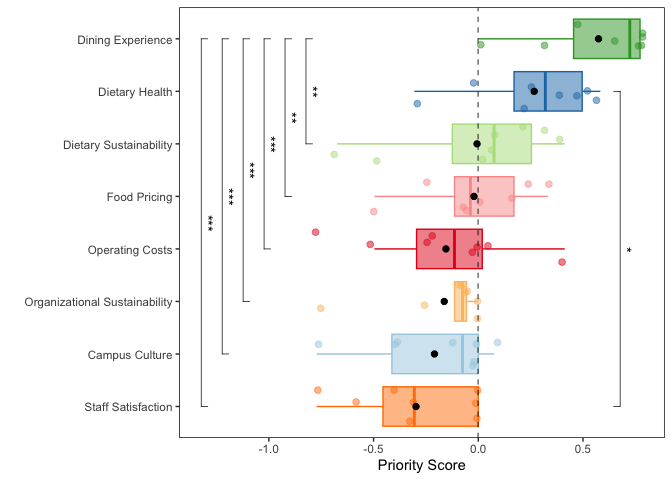
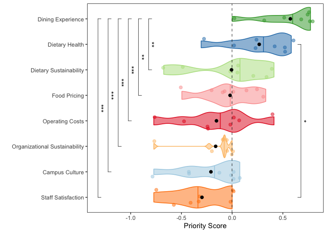
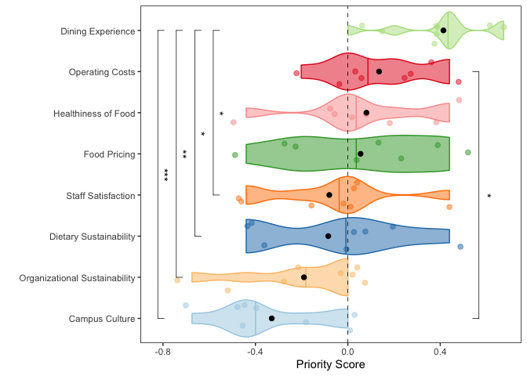
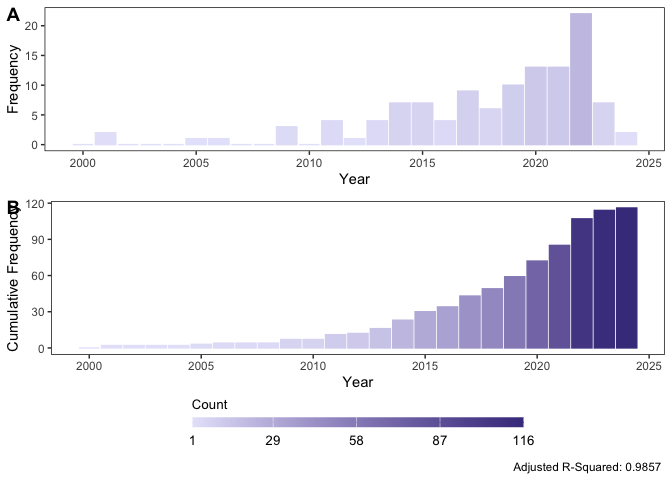
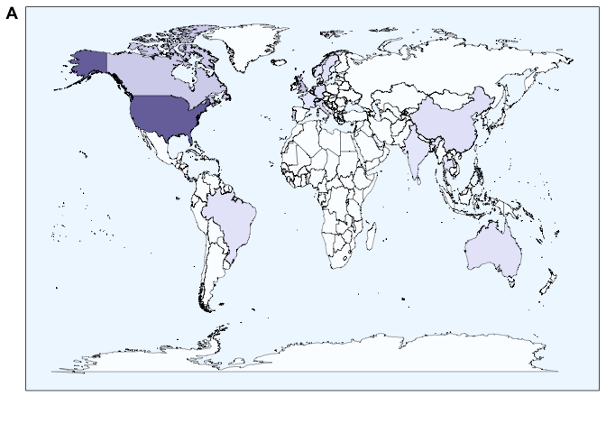
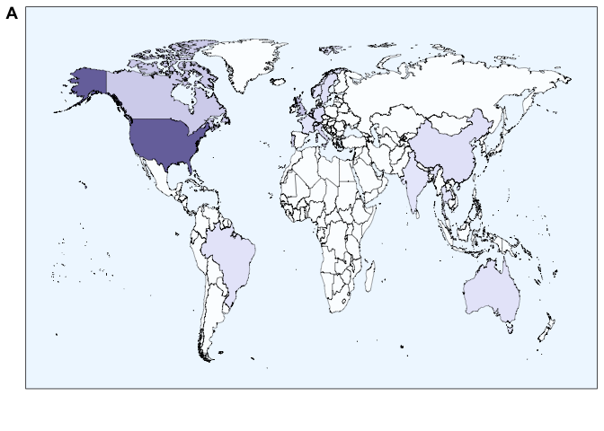
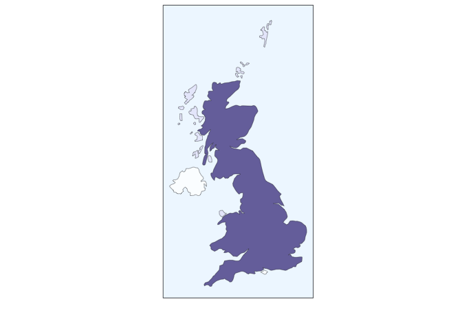
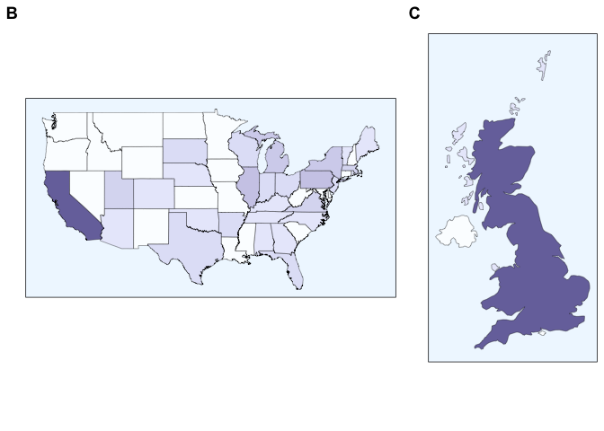

Cleaning Script
================

# Package Loading

``` r
library(tidyverse)
```

    ## ── Attaching core tidyverse packages ──────────────────────── tidyverse 2.0.0 ──
    ## ✔ dplyr     1.1.4     ✔ readr     2.1.5
    ## ✔ forcats   1.0.0     ✔ stringr   1.5.1
    ## ✔ ggplot2   3.5.1     ✔ tibble    3.2.1
    ## ✔ lubridate 1.9.3     ✔ tidyr     1.3.1
    ## ✔ purrr     1.0.2     
    ## ── Conflicts ────────────────────────────────────────── tidyverse_conflicts() ──
    ## ✖ dplyr::filter() masks stats::filter()
    ## ✖ dplyr::lag()    masks stats::lag()
    ## ℹ Use the conflicted package (<http://conflicted.r-lib.org/>) to force all conflicts to become errors

``` r
library(ggpubr)
library(ggsignif)
library(maps)
```

    ## 
    ## Attaching package: 'maps'
    ## 
    ## The following object is masked from 'package:purrr':
    ## 
    ##     map

# Data Loading

``` r
stakeholder_survey <- read.csv("/Users/kenjinchang/github/scr-and-stakeholder-analysis/data/parent-files/survey-data.csv")
review_data <- read.csv("/Users/kenjinchang/github/scr-and-stakeholder-analysis/data/parent-files/review-data.csv")
```

# Cleaning

First, we will need to select and rename the variables relevant to our
plan of analysis. We will specifically focus on the following:

- `date`, which corresponds to the date and time the response was
  recorded
- `completion`, which corresponds to the proportion of the survey that
  was completed
- `channel`, which corresponds to the means through which the survey
  materials were accessed
- `consent`, which corresponds to whether participants provided informed
  consent
- `involvement`, which corresponds to the participants’ self-reported
  role in deciding dining policies and practices
- `involvement_other`, which corresponds to to offered clarifications on
  participants’ reported roles in deciding dining policies and practices
- `stakeholder_type`, which corresponds to the type of professional role
  participants reported as serving
- `stakeholder_type_other`, which corresponds to offered clarifications
  on the type of professional role participants reported as serving
- `title`, which corresponds to participants’ disclosed job titles
- `role_duration`, which corresponds to the number of years participants
  have served in that position
- `dietary_health_ranking`, which corresponds to the level of priority
  given to the healthiness of food offerings
- `dietary_sustainability_ranking`, which corresponds to the level of
  priority given to the sustainability of guest food choices
- `institutional_sustainability_ranking`, which corresponds to the level
  of priority given to the sustainability of dining operations
- `food_pricing_ranking`, which corresponds to the level of priority
  given to the campus food prices
- `operational_costs_ranking`, which corresponds to the level of
  priority given to cost of funding dining operations
- `guest_satisfaction_ranking`, which corresponds to the level of
  priority given to the dining experiences of students
- `worker_satisfaction_ranking`, which corresponds to the level of
  priority given to the labor experiences of dining staff
- `campus_culture_ranking`, which corresponds to the level of priority
  given to campus sustainability culture and the monitoring of spillover
  effects
- `other_ranking`, which corresponds to the level of priority given to
  other relevant indicators of university-based dietary intervention
  performance not considered in the provided list
- `other_ranking_other`, which corresponds to offered indicators

``` r
stakeholder_survey <- stakeholder_survey %>%
  select(RecordedDate,Progress,DistributionChannel,Q1,Q2,Q2_4_TEXT,Q6,Q6_10_TEXT,Q3,Q5_1,Q2_1,Q2_2,Q2_3,Q2_4,Q2_5,Q2_6,Q2_7,Q2_8,Q2_9,Q2_9_TEXT) %>%
  rename(date=RecordedDate,completion=Progress,channel=DistributionChannel,consent=Q1,involvement=Q2,involvement_other=Q2_4_TEXT,stakeholder_type=Q6,stakeholder_type_other=Q6_10_TEXT,title=Q3,role_duration=Q5_1,dietary_health_ranking=Q2_1,dietary_sustainability_ranking=Q2_2,institutional_sustainability_ranking=Q2_3,food_pricing_ranking=Q2_4,operational_costs_ranking=Q2_5,guest_satisfaction_ranking=Q2_6,worker_satisfaction_ranking=Q2_7,campus_culture_ranking=Q2_8,other_ranking=Q2_9,other_ranking_other=Q2_9_TEXT) 
```

We also need to (1) omit the first three rows, which contain information
about how the survey variables are coded and (2) reclass the
`dietary_health_ranking`, `dietary_sustainability_ranking`,
`institutional_sustainability_ranking`, `food_price_ranking`,
`operational_costs_ranking`, `guest_satisfaction_ranking`,
`worker_satisfaction_ranking`, `campus_culure_ranking`, and
`other_ranking` variables from characteric strings to numeric vectors.

``` r
stakeholder_survey <- stakeholder_survey %>%
  slice(3:n()) %>%
  mutate(dietary_health_ranking=as.numeric(dietary_health_ranking)) %>%
  mutate(dietary_sustainability_ranking=as.numeric(dietary_sustainability_ranking)) %>%
  mutate(institutional_sustainability_ranking=as.numeric(institutional_sustainability_ranking)) %>%
  mutate(food_pricing_ranking=as.numeric(food_pricing_ranking)) %>%
  mutate(operational_costs_ranking=as.numeric(operational_costs_ranking)) %>%
  mutate(guest_satisfaction_ranking=as.numeric(guest_satisfaction_ranking)) %>%
  mutate(worker_satisfaction_ranking=as.numeric(worker_satisfaction_ranking)) %>%
  mutate(campus_culture_ranking=as.numeric(campus_culture_ranking)) %>%
  mutate(other_ranking=as.numeric(other_ranking)) 
```

With this complete, we can now move on to address an isolated difference
in how one subject elected to respond to the rank-order choice set. More
specifically, this participant used the provided prompt to suggest an
unlisted performance indicator in `other_ranking_other`, with all other
respondents ranking `other_ranking` last and without any additional
details. Given this, in the interest of constructing a consistent
scoring system, we will narratively note the omission of the suggested
“Cuisine type” indicator in our results while simultaneously removing
the `other_ranking` and `other_ranking_other` variables from the
variable list.

In this particular instance, because the subject identified this
previously unspecified indicator with a rank of “2,” this requires us to
subtract 1 from every ranked indicator apart from
`guest_satisfaction_ranking`, which was ranked first, ahead of “Cuisine
type.”

To accomplish this, we will first transform the data by adding variable
`id` to attach unique identifiers to each individual response. This will
help us isolate the changes in ranking to the one outlying response set.

``` r
stakeholder_survey <- stakeholder_survey %>%
  mutate(id=row_number())
```

Now, we move on to the next step, which involves recoding all rank
responses greater than “2,” such that every performance indicator apart
from `guest_satisfaction_ranking` moves one position ahead to compensate
for the joint removal of `other_ranking` and `other_ranking_other`.

``` r
stakeholder_survey <- stakeholder_survey %>%
  mutate(campus_culture_ranking=case_when(id == 22 ~ 8,
                                          TRUE ~ campus_culture_ranking)) %>%
  mutate(worker_satisfaction_ranking=case_when(id == 22 ~ 7,
                                          TRUE ~ worker_satisfaction_ranking)) %>%
  mutate(operational_costs_ranking=case_when(id == 22 ~ 2,
                                          TRUE ~ worker_satisfaction_ranking)) %>%
  mutate(food_pricing_ranking=case_when(id == 22 ~ 3,
                                          TRUE ~ food_pricing_ranking)) %>%
  mutate(institutional_sustainability_ranking=case_when(id == 22 ~ 4,
                                          TRUE ~ institutional_sustainability_ranking)) %>%
  mutate(dietary_sustainability_ranking=case_when(id == 22 ~ 5,
                                          TRUE ~ dietary_sustainability_ranking)) %>%
  mutate(dietary_health_ranking=case_when(id == 22 ~ 6,
                                          TRUE ~ dietary_health_ranking)) 
```

With

``` r
stakeholder_survey <- stakeholder_survey %>% 
  select(-other_ranking,-other_ranking_other)
```

Inverted scoring system

``` r
stakeholder_survey <- stakeholder_survey %>%
  mutate(dietary_health_score=case_when(dietary_health_ranking == 1 ~ 8,
                                        dietary_health_ranking == 2 ~ 7,
                                        dietary_health_ranking == 3 ~ 6,
                                        dietary_health_ranking == 4 ~ 5,
                                        dietary_health_ranking == 5 ~ 4,
                                        dietary_health_ranking == 6 ~ 3,
                                        dietary_health_ranking == 7 ~ 2,
                                        dietary_health_ranking == 8 ~ 1)) %>%
  mutate(dietary_sustainability_score=case_when(dietary_sustainability_ranking == 1 ~ 8,
                                        dietary_sustainability_ranking == 2 ~ 7,
                                        dietary_sustainability_ranking == 3 ~ 6,
                                        dietary_sustainability_ranking == 4 ~ 5,
                                        dietary_sustainability_ranking == 5 ~ 4,
                                        dietary_sustainability_ranking == 6 ~ 3,
                                        dietary_sustainability_ranking == 7 ~ 2,
                                        dietary_sustainability_ranking == 8 ~ 1)) %>%
  mutate(institutional_sustainability_score=case_when(institutional_sustainability_ranking == 1 ~ 9,
                                        institutional_sustainability_ranking == 2 ~ 8,
                                        institutional_sustainability_ranking == 3 ~ 7,
                                        institutional_sustainability_ranking == 4 ~ 6,
                                        institutional_sustainability_ranking == 5 ~ 5,
                                        institutional_sustainability_ranking == 6 ~ 4,
                                        institutional_sustainability_ranking == 7 ~ 3,
                                        institutional_sustainability_ranking == 8 ~ 2,
                                        institutional_sustainability_ranking == 9 ~ 1)) %>%
  mutate(food_pricing_score=case_when(food_pricing_ranking == 1 ~ 8,
                                        food_pricing_ranking == 2 ~ 7,
                                        food_pricing_ranking == 3 ~ 6,
                                        food_pricing_ranking == 4 ~ 5,
                                        food_pricing_ranking == 5 ~ 4,
                                        food_pricing_ranking == 6 ~ 3,
                                        food_pricing_ranking == 7 ~ 2,
                                        food_pricing_ranking == 8 ~ 1)) %>%
  mutate(operational_costs_score=case_when(operational_costs_ranking == 1 ~ 8,
                                        operational_costs_ranking == 2 ~ 7,
                                        operational_costs_ranking == 3 ~ 6,
                                        operational_costs_ranking == 4 ~ 5,
                                        operational_costs_ranking == 5 ~ 4,
                                        operational_costs_ranking == 6 ~ 3,
                                        operational_costs_ranking == 7 ~ 2,
                                        operational_costs_ranking == 8 ~ 1)) %>%
  mutate(guest_satisfaction_score=case_when(guest_satisfaction_ranking == 1 ~ 8,
                                        guest_satisfaction_ranking == 2 ~ 7,
                                        guest_satisfaction_ranking == 3 ~ 6,
                                        guest_satisfaction_ranking == 4 ~ 5,
                                        guest_satisfaction_ranking == 5 ~ 4,
                                        guest_satisfaction_ranking == 6 ~ 3,
                                        guest_satisfaction_ranking == 7 ~ 2,
                                        guest_satisfaction_ranking == 8 ~ 1)) %>%
  mutate(worker_satisfaction_score=case_when(worker_satisfaction_ranking == 1 ~ 8,
                                        worker_satisfaction_ranking == 2 ~ 7,
                                        worker_satisfaction_ranking == 3 ~ 6,
                                        worker_satisfaction_ranking == 4 ~ 5,
                                        worker_satisfaction_ranking == 5 ~ 4,
                                        worker_satisfaction_ranking == 6 ~ 3,
                                        worker_satisfaction_ranking == 7 ~ 2,
                                        worker_satisfaction_ranking == 8 ~ 1)) %>%
  mutate(campus_culture_score=case_when(campus_culture_ranking == 1 ~ 8,
                                        campus_culture_ranking == 2 ~ 7,
                                        campus_culture_ranking == 3 ~ 6,
                                        campus_culture_ranking == 4 ~ 5,
                                        campus_culture_ranking == 5 ~ 4,
                                        campus_culture_ranking == 6 ~ 3,
                                        campus_culture_ranking == 7 ~ 2,
                                        campus_culture_ranking == 8 ~ 1)) 
```

``` r
stakeholder_survey %>% mutate(dietary_sustainability_over_dietary_health=case_when(dietary_sustainability_ranking<dietary_health_ranking ~ 1,
                                                                                   dietary_sustainability_ranking>dietary_health_ranking ~ 0)) %>%
  summarise(dietary_sustainability_over_dietary_health_sum=sum(dietary_sustainability_over_dietary_health))
```

    ##   dietary_sustainability_over_dietary_health_sum
    ## 1                                             10

``` r
stakeholder_survey %>% mutate(institutional_sustainability_over_dietary_health=case_when(institutional_sustainability_ranking<dietary_health_ranking ~ 1,
                                                                                   institutional_sustainability_ranking>dietary_health_ranking ~ 0)) %>%
  summarise(institutional_sustainability_over_dietary_health_sum=sum(institutional_sustainability_over_dietary_health))
```

    ##   institutional_sustainability_over_dietary_health_sum
    ## 1                                                   13

``` r
stakeholder_survey %>% mutate(food_pricing_over_dietary_health=case_when(food_pricing_ranking<dietary_health_ranking ~ 1,
                                                                                   food_pricing_ranking>dietary_health_ranking ~ 0)) %>%
  summarise(food_pricing_over_dietary_health_sum=sum(food_pricing_over_dietary_health))
```

    ##   food_pricing_over_dietary_health_sum
    ## 1                                   13

``` r
stakeholder_survey %>% mutate(operational_costs_over_dietary_health=case_when(operational_costs_ranking<dietary_health_ranking ~ 1,
                                                                                   operational_costs_ranking>dietary_health_ranking ~ 0)) %>%
  summarise(operational_costs_over_dietary_health_sum=sum(operational_costs_over_dietary_health))
```

    ##   operational_costs_over_dietary_health_sum
    ## 1                                        10

``` r
stakeholder_survey %>% mutate(guest_satisfaction_over_dietary_health=case_when(guest_satisfaction_ranking<dietary_health_ranking ~ 1,
                                                                                   guest_satisfaction_ranking>dietary_health_ranking ~ 0)) %>%
  summarise(guest_satisfaction_over_dietary_health_sum=sum(guest_satisfaction_over_dietary_health))
```

    ##   guest_satisfaction_over_dietary_health_sum
    ## 1                                         20

``` r
stakeholder_survey %>% mutate(worker_satisfaction_over_dietary_health=case_when(worker_satisfaction_ranking<dietary_health_ranking ~ 1,
                                                                                   worker_satisfaction_ranking>dietary_health_ranking ~ 0)) %>%
  summarise(worker_satisfaction_over_dietary_health_sum=sum(worker_satisfaction_over_dietary_health))
```

    ##   worker_satisfaction_over_dietary_health_sum
    ## 1                                           9

``` r
stakeholder_survey %>% mutate(campus_culture_over_dietary_health=case_when(campus_culture_ranking<dietary_health_ranking ~ 1,
                                                                                   campus_culture_ranking>dietary_health_ranking ~ 0)) %>%
  summarise(campus_culture_over_dietary_health_sum=sum(campus_culture_over_dietary_health))
```

    ##   campus_culture_over_dietary_health_sum
    ## 1                                     11

``` r
stakeholder_survey %>% mutate(institutional_sustainability_over_dietary_sustainability=case_when(institutional_sustainability_ranking<dietary_sustainability_ranking ~ 1,
                                                                                   institutional_sustainability_ranking>dietary_sustainability_ranking ~ 0)) %>%
  summarise(institutional_sustainability_over_dietary_sustainability_sum=sum(institutional_sustainability_over_dietary_sustainability))
```

    ##   institutional_sustainability_over_dietary_sustainability_sum
    ## 1                                                           15

``` r
stakeholder_survey %>% mutate(food_pricing_over_dietary_sustainability=case_when(food_pricing_ranking<dietary_sustainability_ranking ~ 1,
                                                                                   food_pricing_ranking>dietary_sustainability_ranking ~ 0)) %>%
  summarise(food_pricing_over_dietary_sustainability_sum=sum(food_pricing_over_dietary_sustainability))
```

    ##   food_pricing_over_dietary_sustainability_sum
    ## 1                                           15

``` r
stakeholder_survey %>% mutate(operational_costs_over_dietary_sustainability=case_when(operational_costs_ranking<dietary_sustainability_ranking ~ 1,
                                                                                   operational_costs_ranking>dietary_sustainability_ranking ~ 0)) %>%
  summarise(operational_costs_over_dietary_sustainability_sum=sum(operational_costs_over_dietary_sustainability))
```

    ##   operational_costs_over_dietary_sustainability_sum
    ## 1                                                13

``` r
stakeholder_survey %>% mutate(guest_satisfaction_over_dietary_sustainability=case_when(guest_satisfaction_ranking<dietary_sustainability_ranking ~ 1,
                                                                                   guest_satisfaction_ranking>dietary_sustainability_ranking ~ 0)) %>%
  summarise(guest_satisfaction_over_dietary_sustainability_sum=sum(guest_satisfaction_over_dietary_sustainability))
```

    ##   guest_satisfaction_over_dietary_sustainability_sum
    ## 1                                                 24

``` r
stakeholder_survey %>% mutate(campus_culture_over_dietary_sustainability=case_when(campus_culture_ranking<dietary_sustainability_ranking ~ 1,
                                                                                   campus_culture_ranking>dietary_sustainability_ranking ~ 0)) %>%
  summarise(campus_culture_over_dietary_sustainability_sum=sum(campus_culture_over_dietary_sustainability))
```

    ##   campus_culture_over_dietary_sustainability_sum
    ## 1                                             11

``` r
stakeholder_survey %>% mutate(food_pricing_over_institutional_sustainability=case_when(food_pricing_ranking<institutional_sustainability_ranking ~ 1,
                                                                                   food_pricing_ranking>institutional_sustainability_ranking ~ 0)) %>%
  summarise(food_pricing_over_institutional_sustainability_sum=sum(food_pricing_over_institutional_sustainability))
```

    ##   food_pricing_over_institutional_sustainability_sum
    ## 1                                                 17

``` r
stakeholder_survey %>% mutate(operational_costs_over_institutional_sustainability=case_when(operational_costs_ranking<institutional_sustainability_ranking ~ 1,
                                                                                   operational_costs_ranking>institutional_sustainability_ranking ~ 0)) %>%
  summarise(operational_costs_over_institutional_sustainability_sum=sum(operational_costs_over_institutional_sustainability))
```

    ##   operational_costs_over_institutional_sustainability_sum
    ## 1                                                      17

``` r
stakeholder_survey %>% mutate(guest_satisfaction_over_institutional_sustainability=case_when(guest_satisfaction_ranking<institutional_sustainability_ranking ~ 1,
                                                                                   guest_satisfaction_ranking>institutional_sustainability_ranking ~ 0)) %>%
  summarise(guest_satisfaction_over_institutional_sustainability_sum=sum(guest_satisfaction_over_institutional_sustainability))
```

    ##   guest_satisfaction_over_institutional_sustainability_sum
    ## 1                                                       25

``` r
stakeholder_survey %>% mutate(worker_satisfaction_over_institutional_sustainability=case_when(worker_satisfaction_ranking<institutional_sustainability_ranking ~ 1,
                                                                                   worker_satisfaction_ranking>institutional_sustainability_ranking ~ 0)) %>%
  summarise(worker_satisfaction_over_institutional_sustainability_sum=sum(worker_satisfaction_over_institutional_sustainability))
```

    ##   worker_satisfaction_over_institutional_sustainability_sum
    ## 1                                                        16

``` r
stakeholder_survey %>% mutate(campus_culture_over_institutional_sustainability=case_when(campus_culture_ranking<institutional_sustainability_ranking ~ 1,
                                                                                   campus_culture_ranking>institutional_sustainability_ranking ~ 0)) %>%
  summarise(campus_culture_over_institutional_sustainability_sum=sum(campus_culture_over_institutional_sustainability))
```

    ##   campus_culture_over_institutional_sustainability_sum
    ## 1                                                   17

``` r
stakeholder_survey %>% mutate(operational_costs_over_food_pricing=case_when(operational_costs_ranking<food_pricing_ranking ~ 1,
                                                                                   operational_costs_ranking>food_pricing_ranking ~ 0)) %>%
  summarise(operational_costs_over_food_pricing_sum=sum(operational_costs_over_food_pricing))
```

    ##   operational_costs_over_food_pricing_sum
    ## 1                                      13

``` r
stakeholder_survey %>% mutate(guest_satisfaction_over_food_pricing=case_when(guest_satisfaction_ranking<food_pricing_ranking ~ 1,
                                                                                   guest_satisfaction_ranking>food_pricing_ranking ~ 0)) %>%
  summarise(guest_satisfaction_over_food_pricing_sum=sum(guest_satisfaction_over_food_pricing))
```

    ##   guest_satisfaction_over_food_pricing_sum
    ## 1                                       22

``` r
stakeholder_survey %>% mutate(worker_satisfaction_over_food_pricing=case_when(worker_satisfaction_ranking<food_pricing_ranking ~ 1,
                                                                                   worker_satisfaction_ranking>food_pricing_ranking ~ 0)) %>%
  summarise(worker_satisfaction_over_food_pricing_sum=sum(worker_satisfaction_over_food_pricing))
```

    ##   worker_satisfaction_over_food_pricing_sum
    ## 1                                        12

``` r
stakeholder_survey %>% mutate(campus_culture_over_food_pricing=case_when(campus_culture_ranking<food_pricing_ranking ~ 1,
                                                                                   campus_culture_ranking>food_pricing_ranking ~ 0)) %>%
  summarise(campus_culture_over_food_pricing_sum=sum(campus_culture_over_food_pricing))
```

    ##   campus_culture_over_food_pricing_sum
    ## 1                                   14

``` r
stakeholder_survey %>% mutate(guest_satisfaction_over_operational_costs=case_when(guest_satisfaction_ranking<operational_costs_ranking ~ 1,
                                                                                   guest_satisfaction_ranking>operational_costs_ranking ~ 0)) %>%
  summarise(guest_satisfaction_over_operational_costs_sum=sum(guest_satisfaction_over_operational_costs))
```

    ##   guest_satisfaction_over_operational_costs_sum
    ## 1                                            25

``` r
stakeholder_survey %>% 
  mutate(worker_satisfaction_over_operational_costs=case_when(worker_satisfaction_ranking<operational_costs_ranking ~ 1,
                                                                                   worker_satisfaction_ranking>operational_costs_ranking ~ 0)) %>%
  summarise(worker_satisfaction_over_operational_costs_sum=sum(worker_satisfaction_over_operational_costs))
```

    ##   worker_satisfaction_over_operational_costs_sum
    ## 1                                             NA

%\>%
summarise(worker_satisfaction_over_operational_costs_sum=sum(worker_satisfaction_over_operational_costs))

``` r
stakeholder_survey %>% mutate(campus_culture_over_operational_costs=case_when(campus_culture_ranking<operational_costs_ranking ~ 1,
                                                                                   campus_culture_ranking>operational_costs_ranking ~ 0)) %>%
  summarise(campus_culture_over_operational_costs_sum=sum(campus_culture_over_operational_costs))
```

    ##   campus_culture_over_operational_costs_sum
    ## 1                                        16

``` r
stakeholder_survey %>% mutate(worker_satisfaction_over_guest_satisfaction=case_when(worker_satisfaction_ranking<guest_satisfaction_ranking ~ 1,
                                                                                   worker_satisfaction_ranking>guest_satisfaction_ranking ~ 0)) %>%
  summarise(worker_satisfaction_over_guest_satisfaction_sum=sum(worker_satisfaction_over_guest_satisfaction))
```

    ##   worker_satisfaction_over_guest_satisfaction_sum
    ## 1                                               7

``` r
stakeholder_survey %>% mutate(campus_culture_over_guest_satisfaction=case_when(campus_culture_ranking<guest_satisfaction_ranking ~ 1,
                                                                                   campus_culture_ranking>guest_satisfaction_ranking ~ 0)) %>%
  summarise(campus_culture_over_guest_satisfaction_sum=sum(campus_culture_over_guest_satisfaction))
```

    ##   campus_culture_over_guest_satisfaction_sum
    ## 1                                          7

``` r
stakeholder_survey %>% mutate(campus_culture_over_worker_satisfaction=case_when(campus_culture_ranking<worker_satisfaction_ranking ~ 1,
                                                                                   campus_culture_ranking>worker_satisfaction_ranking ~ 0)) %>%
  summarise(campus_culture_over_worker_satisfaction_sum=sum(campus_culture_over_worker_satisfaction))
```

    ##   campus_culture_over_worker_satisfaction_sum
    ## 1                                          16

will need to bridge some of these steps, specifically by using qnorm to
perform z-score conversions

for now, we will do our one-way anova and post-hoc tukey tests by
creating a tibble from the information provided in table 4

``` r
holdover_survey_data <- read.csv("/Users/kenjinchang/github/scr-and-stakeholder-analysis/data/holdover-survey-data.csv")
```

``` r
summary_table <- holdover_survey_data %>% 
  group_by(group) %>%
  summarise(count=n(),
            mean=mean(z_score),
            sd=sd(z_score))
summary_table
```

    ## # A tibble: 8 × 4
    ##   group                                count     mean    sd
    ##   <chr>                                <int>    <dbl> <dbl>
    ## 1 Campus Culture                           8 -0.209   0.296
    ## 2 Campus Food Prices                       8 -0.0205  0.265
    ## 3 Guest Dining Experiences                 8  0.574   0.283
    ## 4 Healthiness of Food Offerings            8  0.267   0.299
    ## 5 Institutional Sustainability             8 -0.163   0.256
    ## 6 Operational and Procurement Costs        8 -0.154   0.365
    ## 7 Sustainability of Guest Food Choices     8 -0.00599 0.386
    ## 8 Worker Satisfaction                      8 -0.297   0.289

``` r
summary_table %>%
  summarise(mean=mean(mean))
```

    ## # A tibble: 1 × 1
    ##       mean
    ##      <dbl>
    ## 1 -0.00112

There is a z-score tabulation error in current holdover_data

``` r
holdover_survey_data %>%
  mutate(across(group,str_replace,"Guest Dining Experiences","Dining Experience")) %>%
  mutate(across(group,str_replace,"Healthiness of Food Offerings","Dietary Health")) %>%
  mutate(across(group,str_replace,"Sustainability of Guest Food Choices","Dietary Sustainability")) %>%
  mutate(across(group,str_replace,"Institutional Sustainability","Organizational Sustainability")) %>%
  mutate(across(group,str_replace,"Campus Food Prices","Food Pricing")) %>%
  mutate(across(group,str_replace,"Operational and Procurement Costs","Operating Costs")) %>%
  mutate(across(group,str_replace,"Worker Satisfaction","Staff Satisfaction")) %>%
  mutate(across(group,str_replace,"Campus Culture","Campus Culture")) %>%
  ggplot(aes(y=z_score,x=fct_reorder(group,z_score,.fun="mean"),fill=group,color=group)) + 
  geom_boxplot(outlier.shape=NA,alpha=0.5) +
  geom_jitter(width=0.33,size=2,shape=21,alpha=0.5) +
  geom_hline(yintercept=-0.001115625,linetype="dashed",size=0.3) +
  geom_signif(comparisons=list(c("Dining Experience","Staff Satisfaction")),color="black",size=0.25,annotation="***",y_position=-1.4,tip_length=-0.02,vjust=1) +
  geom_signif(comparisons=list(c("Dining Experience","Campus Culture")),color="black",size=0.25,annotation="***",y_position=-1.3,tip_length=-0.02,vjust=1) +
  geom_signif(comparisons=list(c("Dining Experience","Organizational Sustainability")),color="black",size=0.25,annotation="***",y_position=-1.2,tip_length=-0.02,vjust=1) +
  geom_signif(comparisons=list(c("Dining Experience","Operating Costs")),color="black",size=0.25,annotation="***",y_position=-1.1,tip_length=-0.02,vjust=1) +
  geom_signif(comparisons=list(c("Dining Experience","Food Pricing")),color="black",size=0.25,annotation="**",y_position=-1.0,tip_length=-0.02,vjust=1) +
  geom_signif(comparisons=list(c("Dining Experience","Dietary Sustainability")),color="black",size=0.25,annotation="**",y_position=-0.9,tip_length=-0.02,vjust=1) +
  geom_signif(comparisons=list(c("Staff Satisfaction","Dietary Health")),color="black",size=0.25,annotation="*",y_position=0.6,tip_length=0.02,vjust=0.4) +
  scale_fill_brewer(palette="Paired") + 
  scale_color_brewer(palette="Paired") +
  xlab("") + 
  ylab("Priority Score") +
  stat_summary(fun.y=mean,geom="point",shape=20,size=3,color="black",fill="white") +
  theme(legend.position="none",legend.justification="right",legend.box.spacing=unit(0,"pt"),legend.key.size=unit(10,"pt"),panel.grid=element_blank(),panel.background=element_rect(fill="white"),panel.border=element_rect(fill=NA),legend.title=element_text(size=10),legend.text=element_text(size=10),plot.title=element_text(size=10)) + 
  coord_flip()
```

    ## Warning: There was 1 warning in `mutate()`.
    ## ℹ In argument: `across(group, str_replace, "Guest Dining Experiences", "Dining
    ##   Experience")`.
    ## Caused by warning:
    ## ! The `...` argument of `across()` is deprecated as of dplyr 1.1.0.
    ## Supply arguments directly to `.fns` through an anonymous function instead.
    ## 
    ##   # Previously
    ##   across(a:b, mean, na.rm = TRUE)
    ## 
    ##   # Now
    ##   across(a:b, \(x) mean(x, na.rm = TRUE))

    ## Warning: Using `size` aesthetic for lines was deprecated in ggplot2 3.4.0.
    ## ℹ Please use `linewidth` instead.
    ## This warning is displayed once every 8 hours.
    ## Call `lifecycle::last_lifecycle_warnings()` to see where this warning was
    ## generated.

    ## Warning: The `fun.y` argument of `stat_summary()` is deprecated as of ggplot2 3.3.0.
    ## ℹ Please use the `fun` argument instead.
    ## This warning is displayed once every 8 hours.
    ## Call `lifecycle::last_lifecycle_warnings()` to see where this warning was
    ## generated.

<!-- -->

``` r
holdover_survey_data %>%
  mutate(across(group,str_replace,"Guest Dining Experiences","Dining Experience")) %>%
  mutate(across(group,str_replace,"Healthiness of Food Offerings","Dietary Health")) %>%
  mutate(across(group,str_replace,"Sustainability of Guest Food Choices","Dietary Sustainability")) %>%
  mutate(across(group,str_replace,"Institutional Sustainability","Organizational Sustainability")) %>%
  mutate(across(group,str_replace,"Campus Food Prices","Food Pricing")) %>%
  mutate(across(group,str_replace,"Operational and Procurement Costs","Operating Costs")) %>%
  mutate(across(group,str_replace,"Worker Satisfaction","Staff Satisfaction")) %>%
  mutate(across(group,str_replace,"Campus Culture","Campus Culture")) %>%
  ggplot(aes(y=z_score,x=fct_reorder(group,z_score,.fun="mean"),fill=group,color=group)) + 
  geom_violin(draw_quantiles=0.5,adjust=0.66,alpha=0.5,scale="width",trim=TRUE) + 
  geom_jitter(width=0.33,size=2,shape=21,alpha=0.5) +
  geom_hline(yintercept=-0.001115625,linetype="dashed",size=0.3) +
  geom_signif(comparisons=list(c("Dining Experience","Staff Satisfaction")),color="black",size=0.25,annotation="***",y_position=-1.4,tip_length=-0.02,vjust=1) +
  geom_signif(comparisons=list(c("Dining Experience","Campus Culture")),color="black",size=0.25,annotation="***",y_position=-1.3,tip_length=-0.02,vjust=1) +
  geom_signif(comparisons=list(c("Dining Experience","Organizational Sustainability")),color="black",size=0.25,annotation="***",y_position=-1.2,tip_length=-0.02,vjust=1) +
  geom_signif(comparisons=list(c("Dining Experience","Operating Costs")),color="black",size=0.25,annotation="***",y_position=-1.1,tip_length=-0.02,vjust=1) +
  geom_signif(comparisons=list(c("Dining Experience","Food Pricing")),color="black",size=0.25,annotation="**",y_position=-1.0,tip_length=-0.02,vjust=1) +
  geom_signif(comparisons=list(c("Dining Experience","Dietary Sustainability")),color="black",size=0.25,annotation="**",y_position=-0.9,tip_length=-0.02,vjust=1) +
  geom_signif(comparisons=list(c("Staff Satisfaction","Dietary Health")),color="black",size=0.25,annotation="*",y_position=0.6,tip_length=0.02,vjust=0.4) +
  scale_fill_brewer(palette="Paired") + 
  scale_color_brewer(palette="Paired") +
  xlab("") + 
  ylab("Priority Score") +
  stat_summary(fun.y=mean,geom="point",shape=20,size=3,color="black",fill="white") +
  theme(legend.position="none",legend.justification="right",legend.box.spacing=unit(0,"pt"),legend.key.size=unit(10,"pt"),panel.grid=element_blank(),panel.background=element_rect(fill="white"),panel.border=element_rect(fill=NA),legend.title=element_text(size=10),legend.text=element_text(size=10),plot.title=element_text(size=10)) + 
  coord_flip()
```

<!-- -->

``` r
aov <- aov(z_score ~ group,data=holdover_survey_data)
summary(aov)
```

    ##             Df Sum Sq Mean Sq F value   Pr(>F)    
    ## group        7  4.668  0.6669   7.027 5.17e-06 ***
    ## Residuals   56  5.314  0.0949                     
    ## ---
    ## Signif. codes:  0 '***' 0.001 '**' 0.01 '*' 0.05 '.' 0.1 ' ' 1

multiple tukey pairwise comparisons

``` r
TukeyHSD(aov)
```

    ##   Tukey multiple comparisons of means
    ##     95% family-wise confidence level
    ## 
    ## Fit: aov(formula = z_score ~ group, data = holdover_survey_data)
    ## 
    ## $group
    ##                                                                              diff
    ## Campus Food Prices-Campus Culture                                       0.1886625
    ## Guest Dining Experiences-Campus Culture                                 0.7830000
    ## Healthiness of Food Offerings-Campus Culture                            0.4761875
    ## Institutional Sustainability-Campus Culture                             0.0465000
    ## Operational and Procurement Costs-Campus Culture                        0.0547000
    ## Sustainability of Guest Food Choices-Campus Culture                     0.2031250
    ## Worker Satisfaction-Campus Culture                                     -0.0882000
    ## Guest Dining Experiences-Campus Food Prices                             0.5943375
    ## Healthiness of Food Offerings-Campus Food Prices                        0.2875250
    ## Institutional Sustainability-Campus Food Prices                        -0.1421625
    ## Operational and Procurement Costs-Campus Food Prices                   -0.1339625
    ## Sustainability of Guest Food Choices-Campus Food Prices                 0.0144625
    ## Worker Satisfaction-Campus Food Prices                                 -0.2768625
    ## Healthiness of Food Offerings-Guest Dining Experiences                 -0.3068125
    ## Institutional Sustainability-Guest Dining Experiences                  -0.7365000
    ## Operational and Procurement Costs-Guest Dining Experiences             -0.7283000
    ## Sustainability of Guest Food Choices-Guest Dining Experiences          -0.5798750
    ## Worker Satisfaction-Guest Dining Experiences                           -0.8712000
    ## Institutional Sustainability-Healthiness of Food Offerings             -0.4296875
    ## Operational and Procurement Costs-Healthiness of Food Offerings        -0.4214875
    ## Sustainability of Guest Food Choices-Healthiness of Food Offerings     -0.2730625
    ## Worker Satisfaction-Healthiness of Food Offerings                      -0.5643875
    ## Operational and Procurement Costs-Institutional Sustainability          0.0082000
    ## Sustainability of Guest Food Choices-Institutional Sustainability       0.1566250
    ## Worker Satisfaction-Institutional Sustainability                       -0.1347000
    ## Sustainability of Guest Food Choices-Operational and Procurement Costs  0.1484250
    ## Worker Satisfaction-Operational and Procurement Costs                  -0.1429000
    ## Worker Satisfaction-Sustainability of Guest Food Choices               -0.2913250
    ##                                                                                 lwr
    ## Campus Food Prices-Campus Culture                                      -0.296269567
    ## Guest Dining Experiences-Campus Culture                                 0.298067933
    ## Healthiness of Food Offerings-Campus Culture                           -0.008744567
    ## Institutional Sustainability-Campus Culture                            -0.438432067
    ## Operational and Procurement Costs-Campus Culture                       -0.430232067
    ## Sustainability of Guest Food Choices-Campus Culture                    -0.281807067
    ## Worker Satisfaction-Campus Culture                                     -0.573132067
    ## Guest Dining Experiences-Campus Food Prices                             0.109405433
    ## Healthiness of Food Offerings-Campus Food Prices                       -0.197407067
    ## Institutional Sustainability-Campus Food Prices                        -0.627094567
    ## Operational and Procurement Costs-Campus Food Prices                   -0.618894567
    ## Sustainability of Guest Food Choices-Campus Food Prices                -0.470469567
    ## Worker Satisfaction-Campus Food Prices                                 -0.761794567
    ## Healthiness of Food Offerings-Guest Dining Experiences                 -0.791744567
    ## Institutional Sustainability-Guest Dining Experiences                  -1.221432067
    ## Operational and Procurement Costs-Guest Dining Experiences             -1.213232067
    ## Sustainability of Guest Food Choices-Guest Dining Experiences          -1.064807067
    ## Worker Satisfaction-Guest Dining Experiences                           -1.356132067
    ## Institutional Sustainability-Healthiness of Food Offerings             -0.914619567
    ## Operational and Procurement Costs-Healthiness of Food Offerings        -0.906419567
    ## Sustainability of Guest Food Choices-Healthiness of Food Offerings     -0.757994567
    ## Worker Satisfaction-Healthiness of Food Offerings                      -1.049319567
    ## Operational and Procurement Costs-Institutional Sustainability         -0.476732067
    ## Sustainability of Guest Food Choices-Institutional Sustainability      -0.328307067
    ## Worker Satisfaction-Institutional Sustainability                       -0.619632067
    ## Sustainability of Guest Food Choices-Operational and Procurement Costs -0.336507067
    ## Worker Satisfaction-Operational and Procurement Costs                  -0.627832067
    ## Worker Satisfaction-Sustainability of Guest Food Choices               -0.776257067
    ##                                                                                upr
    ## Campus Food Prices-Campus Culture                                       0.67359457
    ## Guest Dining Experiences-Campus Culture                                 1.26793207
    ## Healthiness of Food Offerings-Campus Culture                            0.96111957
    ## Institutional Sustainability-Campus Culture                             0.53143207
    ## Operational and Procurement Costs-Campus Culture                        0.53963207
    ## Sustainability of Guest Food Choices-Campus Culture                     0.68805707
    ## Worker Satisfaction-Campus Culture                                      0.39673207
    ## Guest Dining Experiences-Campus Food Prices                             1.07926957
    ## Healthiness of Food Offerings-Campus Food Prices                        0.77245707
    ## Institutional Sustainability-Campus Food Prices                         0.34276957
    ## Operational and Procurement Costs-Campus Food Prices                    0.35096957
    ## Sustainability of Guest Food Choices-Campus Food Prices                 0.49939457
    ## Worker Satisfaction-Campus Food Prices                                  0.20806957
    ## Healthiness of Food Offerings-Guest Dining Experiences                  0.17811957
    ## Institutional Sustainability-Guest Dining Experiences                  -0.25156793
    ## Operational and Procurement Costs-Guest Dining Experiences             -0.24336793
    ## Sustainability of Guest Food Choices-Guest Dining Experiences          -0.09494293
    ## Worker Satisfaction-Guest Dining Experiences                           -0.38626793
    ## Institutional Sustainability-Healthiness of Food Offerings              0.05524457
    ## Operational and Procurement Costs-Healthiness of Food Offerings         0.06344457
    ## Sustainability of Guest Food Choices-Healthiness of Food Offerings      0.21186957
    ## Worker Satisfaction-Healthiness of Food Offerings                      -0.07945543
    ## Operational and Procurement Costs-Institutional Sustainability          0.49313207
    ## Sustainability of Guest Food Choices-Institutional Sustainability       0.64155707
    ## Worker Satisfaction-Institutional Sustainability                        0.35023207
    ## Sustainability of Guest Food Choices-Operational and Procurement Costs  0.63335707
    ## Worker Satisfaction-Operational and Procurement Costs                   0.34203207
    ## Worker Satisfaction-Sustainability of Guest Food Choices                0.19360707
    ##                                                                            p adj
    ## Campus Food Prices-Campus Culture                                      0.9210132
    ## Guest Dining Experiences-Campus Culture                                0.0001151
    ## Healthiness of Food Offerings-Campus Culture                           0.0577452
    ## Institutional Sustainability-Campus Culture                            0.9999873
    ## Operational and Procurement Costs-Campus Culture                       0.9999615
    ## Sustainability of Guest Food Choices-Campus Culture                    0.8878762
    ## Worker Satisfaction-Campus Culture                                     0.9990727
    ## Guest Dining Experiences-Campus Food Prices                            0.0067500
    ## Healthiness of Food Offerings-Campus Food Prices                       0.5787489
    ## Institutional Sustainability-Campus Food Prices                        0.9825184
    ## Operational and Procurement Costs-Campus Food Prices                   0.9876030
    ## Sustainability of Guest Food Choices-Campus Food Prices                1.0000000
    ## Worker Satisfaction-Campus Food Prices                                 0.6243598
    ## Healthiness of Food Offerings-Guest Dining Experiences                 0.4963788
    ## Institutional Sustainability-Guest Dining Experiences                  0.0003308
    ## Operational and Procurement Costs-Guest Dining Experiences             0.0003974
    ## Sustainability of Guest Food Choices-Guest Dining Experiences          0.0089635
    ## Worker Satisfaction-Guest Dining Experiences                           0.0000146
    ## Institutional Sustainability-Healthiness of Food Offerings             0.1184066
    ## Operational and Procurement Costs-Healthiness of Food Offerings        0.1331980
    ## Sustainability of Guest Food Choices-Healthiness of Food Offerings     0.6404703
    ## Worker Satisfaction-Healthiness of Food Offerings                      0.0120744
    ## Operational and Procurement Costs-Institutional Sustainability         1.0000000
    ## Sustainability of Guest Food Choices-Institutional Sustainability      0.9699321
    ## Worker Satisfaction-Institutional Sustainability                       0.9871988
    ## Sustainability of Guest Food Choices-Operational and Procurement Costs 0.9776821
    ## Worker Satisfaction-Operational and Procurement Costs                  0.9819941
    ## Worker Satisfaction-Sustainability of Guest Food Choices               0.5624358

from this, we can glean that there are statistically significant
differences between guest satisfaction and six of the remaining
performance indicators: culture (p=0.0001151), food pricing
(p=0.0067500), institutional sustainability (p=0.0003308), operational
costs (p=0.0003974), dietary sustainability (p=0.0089635), and worker
satisfaction (p=0.0000146), as well as between worker satisfaction and
dietary health (p=0.0120744).

need to stratify by involvement

``` r
write.csv(stakeholder_survey,file="/Users/kenjinchang/github/scr-and-stakeholder-analysis/data/cleaned-files/survey-data.csv")
```

``` r
stakeholder_survey %>% 
  group_by(involvement) %>%
  summarise(count=n())
```

    ## # A tibble: 4 × 2
    ##   involvement                           count
    ##   <chr>                                 <int>
    ## 1 I am a primary decision maker            12
    ## 2 I consult on best practices              16
    ## 3 I offer feedback on existing services     3
    ## 4 Other (please specify):                   1

``` r
pdm_holdover_survey_data <- read.csv("/Users/kenjinchang/github/scr-and-stakeholder-analysis/data/pdm-holdover-survey-data.csv")
```

``` r
pdm_summary_table <- pdm_holdover_survey_data %>% 
  group_by(group) %>%
  summarise(count=n(),
            mean=mean(z_score),
            sd=sd(z_score))
pdm_summary_table
```

    ## # A tibble: 8 × 4
    ##   group                                count    mean    sd
    ##   <chr>                                <int>   <dbl> <dbl>
    ## 1 Campus Culture                           8 -0.330  0.239
    ## 2 Campus Food Prices                       8  0.0550 0.321
    ## 3 Guest Dining Experiences                 8  0.414  0.225
    ## 4 Healthiness of Food                      8  0.0802 0.285
    ## 5 Institutional Sustainability             8 -0.190  0.251
    ## 6 Operational and Procurement Costs        8  0.135  0.228
    ## 7 Sustainability of Guest Food Choices     8 -0.0847 0.329
    ## 8 Worker Satisfaction                      8 -0.0802 0.285

``` r
pdm_summary_table %>%
  summarise(mean=mean(mean))
```

    ## # A tibble: 1 × 1
    ##    mean
    ##   <dbl>
    ## 1     0

``` r
pdm_holdover_survey_data %>%
  mutate(across(group,str_replace,"Guest Dining Experiences","Dining Experience")) %>%
  mutate(across(group,str_replace,"Healthiness of Food Offerings","Dietary Health")) %>%
  mutate(across(group,str_replace,"Sustainability of Guest Food Choices","Dietary Sustainability")) %>%
  mutate(across(group,str_replace,"Institutional Sustainability","Organizational Sustainability")) %>%
  mutate(across(group,str_replace,"Campus Food Prices","Food Pricing")) %>%
  mutate(across(group,str_replace,"Operational and Procurement Costs","Operating Costs")) %>%
  mutate(across(group,str_replace,"Worker Satisfaction","Staff Satisfaction")) %>%
  mutate(across(group,str_replace,"Campus Culture","Campus Culture")) %>%
  ggplot(aes(y=z_score,x=fct_reorder(group,z_score,.fun="mean"),fill=group,color=group)) + 
  geom_violin(draw_quantiles=0.5,adjust=0.66,alpha=0.5,scale="width",trim=TRUE) + 
  geom_jitter(width=0.33,size=2,shape=21,alpha=0.5) +
  geom_hline(yintercept=0,linetype="dashed",size=0.3) +
  geom_signif(comparisons=list(c("Dining Experience","Campus Culture")),color="black",size=0.25,annotation="***",y_position=-0.89,tip_length=-0.02,vjust=1) +
geom_signif(comparisons=list(c("Operating Costs","Campus Culture")),color="black",size=0.25,annotation="*",y_position=0.5,tip_length=0.02,vjust=0) +
geom_signif(comparisons=list(c("Organizational Sustainability","Dining Experience")),color="black",size=0.25,annotation="**",y_position=-0.81,tip_length=-0.02,vjust=1) +
geom_signif(comparisons=list(c("Dietary Sustainability","Dining Experience")),color="black",size=0.25,annotation="*",y_position=-0.73,tip_length=-0.02,vjust=1) +
geom_signif(comparisons=list(c("Staff Satisfaction","Dining Experience")),color="black",size=0.25,annotation="*",y_position=-0.65,tip_length=-0.02,vjust=1) +
  scale_fill_brewer(palette="Paired") + 
  scale_color_brewer(palette="Paired") +
  xlab("") + 
  ylab("Priority Score") +
  stat_summary(fun.y=mean,geom="point",shape=20,size=3,color="black",fill="white") +
  theme(legend.position="none",legend.justification="right",legend.box.spacing=unit(0,"pt"),legend.key.size=unit(10,"pt"),panel.grid=element_blank(),panel.background=element_rect(fill="white"),panel.border=element_rect(fill=NA),legend.title=element_text(size=10),legend.text=element_text(size=10),plot.title=element_text(size=10)) + 
  coord_flip()
```

<!-- -->

``` r
pdm_aov <- aov(z_score ~ group,data=pdm_holdover_survey_data)
summary(pdm_aov)
```

    ##             Df Sum Sq Mean Sq F value   Pr(>F)    
    ## group        7  2.857  0.4082   5.472 7.96e-05 ***
    ## Residuals   56  4.177  0.0746                     
    ## ---
    ## Signif. codes:  0 '***' 0.001 '**' 0.01 '*' 0.05 '.' 0.1 ' ' 1

``` r
TukeyHSD(pdm_aov)
```

    ##   Tukey multiple comparisons of means
    ##     95% family-wise confidence level
    ## 
    ## Fit: aov(formula = z_score ~ group, data = pdm_holdover_survey_data)
    ## 
    ## $group
    ##                                                                              diff
    ## Campus Food Prices-Campus Culture                                       0.3844875
    ## Guest Dining Experiences-Campus Culture                                 0.7433125
    ## Healthiness of Food-Campus Culture                                      0.4097250
    ## Institutional Sustainability-Campus Culture                             0.1397250
    ## Operational and Procurement Costs-Campus Culture                        0.4647125
    ## Sustainability of Guest Food Choices-Campus Culture                     0.2447625
    ## Worker Satisfaction-Campus Culture                                      0.2492750
    ## Guest Dining Experiences-Campus Food Prices                             0.3588250
    ## Healthiness of Food-Campus Food Prices                                  0.0252375
    ## Institutional Sustainability-Campus Food Prices                        -0.2447625
    ## Operational and Procurement Costs-Campus Food Prices                    0.0802250
    ## Sustainability of Guest Food Choices-Campus Food Prices                -0.1397250
    ## Worker Satisfaction-Campus Food Prices                                 -0.1352125
    ## Healthiness of Food-Guest Dining Experiences                           -0.3335875
    ## Institutional Sustainability-Guest Dining Experiences                  -0.6035875
    ## Operational and Procurement Costs-Guest Dining Experiences             -0.2786000
    ## Sustainability of Guest Food Choices-Guest Dining Experiences          -0.4985500
    ## Worker Satisfaction-Guest Dining Experiences                           -0.4940375
    ## Institutional Sustainability-Healthiness of Food                       -0.2700000
    ## Operational and Procurement Costs-Healthiness of Food                   0.0549875
    ## Sustainability of Guest Food Choices-Healthiness of Food               -0.1649625
    ## Worker Satisfaction-Healthiness of Food                                -0.1604500
    ## Operational and Procurement Costs-Institutional Sustainability          0.3249875
    ## Sustainability of Guest Food Choices-Institutional Sustainability       0.1050375
    ## Worker Satisfaction-Institutional Sustainability                        0.1095500
    ## Sustainability of Guest Food Choices-Operational and Procurement Costs -0.2199500
    ## Worker Satisfaction-Operational and Procurement Costs                  -0.2154375
    ## Worker Satisfaction-Sustainability of Guest Food Choices                0.0045125
    ##                                                                                lwr
    ## Campus Food Prices-Campus Culture                                      -0.04544263
    ## Guest Dining Experiences-Campus Culture                                 0.31338237
    ## Healthiness of Food-Campus Culture                                     -0.02020513
    ## Institutional Sustainability-Campus Culture                            -0.29020513
    ## Operational and Procurement Costs-Campus Culture                        0.03478237
    ## Sustainability of Guest Food Choices-Campus Culture                    -0.18516763
    ## Worker Satisfaction-Campus Culture                                     -0.18065513
    ## Guest Dining Experiences-Campus Food Prices                            -0.07110513
    ## Healthiness of Food-Campus Food Prices                                 -0.40469263
    ## Institutional Sustainability-Campus Food Prices                        -0.67469263
    ## Operational and Procurement Costs-Campus Food Prices                   -0.34970513
    ## Sustainability of Guest Food Choices-Campus Food Prices                -0.56965513
    ## Worker Satisfaction-Campus Food Prices                                 -0.56514263
    ## Healthiness of Food-Guest Dining Experiences                           -0.76351763
    ## Institutional Sustainability-Guest Dining Experiences                  -1.03351763
    ## Operational and Procurement Costs-Guest Dining Experiences             -0.70853013
    ## Sustainability of Guest Food Choices-Guest Dining Experiences          -0.92848013
    ## Worker Satisfaction-Guest Dining Experiences                           -0.92396763
    ## Institutional Sustainability-Healthiness of Food                       -0.69993013
    ## Operational and Procurement Costs-Healthiness of Food                  -0.37494263
    ## Sustainability of Guest Food Choices-Healthiness of Food               -0.59489263
    ## Worker Satisfaction-Healthiness of Food                                -0.59038013
    ## Operational and Procurement Costs-Institutional Sustainability         -0.10494263
    ## Sustainability of Guest Food Choices-Institutional Sustainability      -0.32489263
    ## Worker Satisfaction-Institutional Sustainability                       -0.32038013
    ## Sustainability of Guest Food Choices-Operational and Procurement Costs -0.64988013
    ## Worker Satisfaction-Operational and Procurement Costs                  -0.64536763
    ## Worker Satisfaction-Sustainability of Guest Food Choices               -0.42541763
    ##                                                                                upr
    ## Campus Food Prices-Campus Culture                                       0.81441763
    ## Guest Dining Experiences-Campus Culture                                 1.17324263
    ## Healthiness of Food-Campus Culture                                      0.83965513
    ## Institutional Sustainability-Campus Culture                             0.56965513
    ## Operational and Procurement Costs-Campus Culture                        0.89464263
    ## Sustainability of Guest Food Choices-Campus Culture                     0.67469263
    ## Worker Satisfaction-Campus Culture                                      0.67920513
    ## Guest Dining Experiences-Campus Food Prices                             0.78875513
    ## Healthiness of Food-Campus Food Prices                                  0.45516763
    ## Institutional Sustainability-Campus Food Prices                         0.18516763
    ## Operational and Procurement Costs-Campus Food Prices                    0.51015513
    ## Sustainability of Guest Food Choices-Campus Food Prices                 0.29020513
    ## Worker Satisfaction-Campus Food Prices                                  0.29471763
    ## Healthiness of Food-Guest Dining Experiences                            0.09634263
    ## Institutional Sustainability-Guest Dining Experiences                  -0.17365737
    ## Operational and Procurement Costs-Guest Dining Experiences              0.15133013
    ## Sustainability of Guest Food Choices-Guest Dining Experiences          -0.06861987
    ## Worker Satisfaction-Guest Dining Experiences                           -0.06410737
    ## Institutional Sustainability-Healthiness of Food                        0.15993013
    ## Operational and Procurement Costs-Healthiness of Food                   0.48491763
    ## Sustainability of Guest Food Choices-Healthiness of Food                0.26496763
    ## Worker Satisfaction-Healthiness of Food                                 0.26948013
    ## Operational and Procurement Costs-Institutional Sustainability          0.75491763
    ## Sustainability of Guest Food Choices-Institutional Sustainability       0.53496763
    ## Worker Satisfaction-Institutional Sustainability                        0.53948013
    ## Sustainability of Guest Food Choices-Operational and Procurement Costs  0.20998013
    ## Worker Satisfaction-Operational and Procurement Costs                   0.21449263
    ## Worker Satisfaction-Sustainability of Guest Food Choices                0.43444263
    ##                                                                            p adj
    ## Campus Food Prices-Campus Culture                                      0.1117050
    ## Guest Dining Experiences-Campus Culture                                0.0000317
    ## Healthiness of Food-Campus Culture                                     0.0723575
    ## Institutional Sustainability-Campus Culture                            0.9688950
    ## Operational and Procurement Costs-Campus Culture                       0.0253903
    ## Sustainability of Guest Food Choices-Campus Culture                    0.6277049
    ## Worker Satisfaction-Campus Culture                                     0.6060064
    ## Guest Dining Experiences-Campus Food Prices                            0.1679123
    ## Healthiness of Food-Campus Food Prices                                 0.9999996
    ## Institutional Sustainability-Campus Food Prices                        0.6277049
    ## Operational and Procurement Costs-Campus Food Prices                   0.9989056
    ## Sustainability of Guest Food Choices-Campus Food Prices                0.9688950
    ## Worker Satisfaction-Campus Food Prices                                 0.9740323
    ## Healthiness of Food-Guest Dining Experiences                           0.2417380
    ## Institutional Sustainability-Guest Dining Experiences                  0.0011259
    ## Operational and Procurement Costs-Guest Dining Experiences             0.4652877
    ## Sustainability of Guest Food Choices-Guest Dining Experiences          0.0125558
    ## Worker Satisfaction-Guest Dining Experiences                           0.0138246
    ## Institutional Sustainability-Healthiness of Food                       0.5059806
    ## Operational and Procurement Costs-Healthiness of Food                  0.9999100
    ## Sustainability of Guest Food Choices-Healthiness of Food               0.9262039
    ## Worker Satisfaction-Healthiness of Food                                0.9357230
    ## Operational and Procurement Costs-Institutional Sustainability         0.2713059
    ## Sustainability of Guest Food Choices-Institutional Sustainability      0.9940480
    ## Worker Satisfaction-Institutional Sustainability                       0.9923235
    ## Sustainability of Guest Food Choices-Operational and Procurement Costs 0.7419778
    ## Worker Satisfaction-Operational and Procurement Costs                  0.7612961
    ## Worker Satisfaction-Sustainability of Guest Food Choices               1.0000000

Guest Dining Experiences-Campus Culture 0.0000317 Operational and
Procurement Costs-Campus Culture 0.0253903 Institutional
Sustainability-Guest Dining Experiences 0.0011259 Sustainability of
Guest Food Choices-Guest Dining Experiences 0.0125558 Worker
Satisfaction-Guest Dining Experiences 0.0138246

geom_signif(comparisons=list(c(“Dining Experience”,“Campus
Culture”)),color=“black”,size=0.25,annotation=“***”,y_position=-1.3,tip_length=-0.02,vjust=1) +
geom_signif(comparisons=list(c(”Dining Experience”,”Organizational
Sustainability”)),color=”black”,size=0.25,annotation=”***”,y_position=-1.2,tip_length=-0.02,vjust=1) +
geom_signif(comparisons=list(c(“Dining Experience”,“Operating
Costs”)),color=“black”,size=0.25,annotation=“\*\**“,y_position=-1.1,tip_length=-0.02,vjust=1) +
geom_signif(comparisons=list(c(”Dining Experience”,“Food
Pricing”)),color=“black”,size=0.25,annotation=“**”,y_position=-1.0,tip_length=-0.02,vjust=1) +
geom_signif(comparisons=list(c(”Dining Experience”,”Dietary
Sustainability”)),color=”black”,size=0.25,annotation=”**”,y_position=-0.9,tip_length=-0.02,vjust=1) +
geom_signif(comparisons=list(c(“Staff Satisfaction”,“Dietary
Health”)),color=“black”,size=0.25,annotation=“*”,y_position=0.6,tip_length=0.02,vjust=0.4)
+

``` r
stakeholder_survey %>%
  summarise(dietary_health_score_sum=sum(dietary_health_score),dietary_sustainability_score=sum(dietary_sustainability_score),institutional_sustainability_score_sum=sum(institutional_sustainability_score),food_pricing_score_sum=sum(food_pricing_score),operational_costs_score_sum=sum(operational_costs_score),guest_satisfaction_score_sum=sum(guest_satisfaction_score),worker_satisfaction_score_sum=sum(worker_satisfaction_score),campus_culture_score_sum=sum(worker_satisfaction_score),campus_culture_score_sum=sum(campus_culture_score)) 
```

    ##   dietary_health_score_sum dietary_sustainability_score
    ## 1                      165                          139
    ##   institutional_sustainability_score_sum food_pricing_score_sum
    ## 1                                    155                    136
    ##   operational_costs_score_sum guest_satisfaction_score_sum
    ## 1                         120                          194
    ##   worker_satisfaction_score_sum campus_culture_score_sum
    ## 1                           115                      120

``` r
stakeholder_survey %>%
  group_by(involvement) %>%
  summarise(dietary_health_score_mean=mean(dietary_health_score),dietary_sustainability_score_mean=mean(dietary_sustainability_score),institutional_sustainability_score_mean=mean(institutional_sustainability_score),institutional_sustainability_score_mean=mean(institutional_sustainability_score),food_pricing_score_mean=mean(food_pricing_score),operational_costs_score_mean=mean(operational_costs_score),guest_satisfaction_score_mean=mean(guest_satisfaction_score),worker_satisfaction_score_mean=mean(worker_satisfaction_score),campus_culture_score_mean=mean(campus_culture_score),n=n())
```

    ## # A tibble: 4 × 10
    ##   involvement                      dietary_health_score…¹ dietary_sustainabili…²
    ##   <chr>                                             <dbl>                  <dbl>
    ## 1 I am a primary decision maker                      4.75                   4.25
    ## 2 I consult on best practices                        5.31                   4.56
    ## 3 I offer feedback on existing se…                   5.67                   3.33
    ## 4 Other (please specify):                            6                      5   
    ## # ℹ abbreviated names: ¹​dietary_health_score_mean,
    ## #   ²​dietary_sustainability_score_mean
    ## # ℹ 7 more variables: institutional_sustainability_score_mean <dbl>,
    ## #   food_pricing_score_mean <dbl>, operational_costs_score_mean <dbl>,
    ## #   guest_satisfaction_score_mean <dbl>, worker_satisfaction_score_mean <dbl>,
    ## #   campus_culture_score_mean <dbl>, n <int>

``` r
stakeholder_survey %>%
  group_by(stakeholder_type) %>%
  summarise(dietary_health_score_mean=mean(dietary_health_score),dietary_sustainability_score_mean=mean(dietary_sustainability_score),institutional_sustainability_score_mean=mean(institutional_sustainability_score),institutional_sustainability_score_mean=mean(institutional_sustainability_score),food_pricing_score_mean=mean(food_pricing_score),operational_costs_score_mean=mean(operational_costs_score),guest_satisfaction_score_mean=mean(guest_satisfaction_score),worker_satisfaction_score_mean=mean(worker_satisfaction_score),campus_culture_score_mean=mean(campus_culture_score),n=n())
```

    ## # A tibble: 6 × 10
    ##   stakeholder_type           dietary_health_score_mean dietary_sustainability_…¹
    ##   <chr>                                          <dbl>                     <dbl>
    ## 1 Chef                                            4                         4.25
    ## 2 Dining director                                 4.71                      4.71
    ## 3 Nutrition specialist                            6.4                       4.6 
    ## 4 Other (please specify):                         5.83                      4.67
    ## 5 Sustainability coordinator                      4.5                       4.83
    ## 6 University administrator                        5.5                       2.25
    ## # ℹ abbreviated name: ¹​dietary_sustainability_score_mean
    ## # ℹ 7 more variables: institutional_sustainability_score_mean <dbl>,
    ## #   food_pricing_score_mean <dbl>, operational_costs_score_mean <dbl>,
    ## #   guest_satisfaction_score_mean <dbl>, worker_satisfaction_score_mean <dbl>,
    ## #   campus_culture_score_mean <dbl>, n <int>

``` r
stakeholder_survey %>%
  summarise(dietary_health_score_mean=mean(dietary_health_score),dietary_sustainability_score_mean=mean(dietary_sustainability_score),institutional_sustainability_score_mean=mean(institutional_sustainability_score),institutional_sustainability_score_mean=mean(institutional_sustainability_score),food_pricing_score_mean=mean(food_pricing_score),operational_costs_score_mean=mean(operational_costs_score),guest_satisfaction_score_mean=mean(guest_satisfaction_score),worker_satisfaction_score_mean=mean(worker_satisfaction_score),campus_culture_score_mean=mean(campus_culture_score),n=n())
```

    ##   dietary_health_score_mean dietary_sustainability_score_mean
    ## 1                   5.15625                           4.34375
    ##   institutional_sustainability_score_mean food_pricing_score_mean
    ## 1                                 4.84375                    4.25
    ##   operational_costs_score_mean guest_satisfaction_score_mean
    ## 1                         3.75                        6.0625
    ##   worker_satisfaction_score_mean campus_culture_score_mean  n
    ## 1                        3.59375                      3.75 32

``` r
stakeholder_survey %>%
  summarise(dietary_health_score_sum=sum(dietary_health_score),dietary_sustainability_score_sum=sum(dietary_sustainability_score),institutional_sustainability_score_sum=sum(institutional_sustainability_score),institutional_sustainability_score_sum=sum(institutional_sustainability_score),food_pricing_score_sum=sum(food_pricing_score),operational_costs_score_sum=sum(operational_costs_score),guest_satisfaction_score_sum=sum(guest_satisfaction_score),worker_satisfaction_score_sum=sum(worker_satisfaction_score),campus_culture_score_sum=sum(campus_culture_score),n=n())
```

    ##   dietary_health_score_sum dietary_sustainability_score_sum
    ## 1                      165                              139
    ##   institutional_sustainability_score_sum food_pricing_score_sum
    ## 1                                    155                    136
    ##   operational_costs_score_sum guest_satisfaction_score_sum
    ## 1                         120                          194
    ##   worker_satisfaction_score_sum campus_culture_score_sum  n
    ## 1                           115                      120 32

# Extraction Data

``` r
global_shapefile <- map_data("world")
```

``` r
global_shapefile <- global_shapefile %>% 
  rename(country=region) %>%
  mutate(country=case_when(country=="Macedonia"~"North Macedonia",
                           country=="Ivory Coast"~"Cote d'Ivoire",
                           country=="Democratic Republic of the Congo"~"Congo, Dem. Rep.",
                           country=="Republic of Congo"~"Congo, Rep.",
                           country=="UK"~"United Kingdom",
                           country=="USA"~"United States",
                           country=="Laos"~"Lao",
                           country=="Slovakia"~"Slovak Republic",
                           country=="Saint Lucia"~"St. Lucia",
                           country=="Kyrgyzstan"~"Krygyz Republic",
                           country=="Micronesia"~"Micronesia, Fed. Sts.",
                           country=="Swaziland"~"Eswatini",
                           country=="Virgin Islands"~"Virgin Islands (U.S.)",
                        TRUE~country))
island_nations <- c("Antigua","Barbuda","Nevis", 
                 "Saint Kitts","Trinidad",
                 "Tobago","Grenadines","Saint Vincent")
island_nations_match <- global_shapefile %>% 
  filter(country %in% island_nations)
island_nations_match %>% distinct(country)
```

    ##         country
    ## 1       Antigua
    ## 2       Barbuda
    ## 3         Nevis
    ## 4   Saint Kitts
    ## 5      Trinidad
    ## 6        Tobago
    ## 7    Grenadines
    ## 8 Saint Vincent

``` r
ant_bar <- c(137,138 )
kit_nev <- c(930,931)
tri_tog <- c(1425,1426)
vin_gre <- c(1575,1576,1577)
island_nation_names <- c("Antigua and Barbuda","St. Kitts and Nevis","Trinidad and Tobago","St. Vincent and the Grenadines")
island_nations_match <- island_nations_match %>% 
  mutate(country=case_when(group %in% ant_bar~"Antigua and Barbuda",
                           group %in% kit_nev~"St. Kitts and Nevis",
                           group %in% tri_tog~"Trinidad and Tobago",
                           group %in% vin_gre~"St. Vincent and the Grenadines")) %>% 
  tibble()
island_nations_match %>%
  distinct(country) 
```

    ## # A tibble: 4 × 1
    ##   country                       
    ##   <chr>                         
    ## 1 Antigua and Barbuda           
    ## 2 St. Kitts and Nevis           
    ## 3 Trinidad and Tobago           
    ## 4 St. Vincent and the Grenadines

``` r
global_shapefile <- global_shapefile %>%
  filter(!country %in% island_nation_names)
global_shapefile <- global_shapefile %>% 
  bind_rows(island_nations_match) %>%
  arrange(country) %>%
  tibble()
sra_names <- c("Hong Kong","Macao")
hk_mc <- global_shapefile %>% 
  filter(subregion %in% sra_names)
hk_mc <- hk_mc %>%
  mutate(country = case_when(subregion=="Hong Kong"~"Hong Kong, China",
                             subregion=="Macao"~"Macao, China"))
global_shapefile <- global_shapefile %>%
  filter(!subregion %in% sra_names)
global_shapefile <- global_shapefile %>% 
  bind_rows(hk_mc) %>%
  select(-subregion) %>% 
  tibble()
```

``` r
global_shapefile %>%
  distinct(country)
```

    ## # A tibble: 258 × 1
    ##    country            
    ##    <chr>              
    ##  1 Afghanistan        
    ##  2 Albania            
    ##  3 Algeria            
    ##  4 American Samoa     
    ##  5 Andorra            
    ##  6 Angola             
    ##  7 Anguilla           
    ##  8 Antarctica         
    ##  9 Antigua            
    ## 10 Antigua and Barbuda
    ## # ℹ 248 more rows

``` r
annual_frequencies <- review_data %>%
  select(Publication.Year,Participating.Institutions) %>%
  drop_na() %>%
  rename(year=Publication.Year,sites=Participating.Institutions) %>%
  mutate(count=case_when(sites >= 1 ~ 1)) %>%
  group_by(year) %>%
  summarise(frequency=sum(count)) 
```

``` r
annual_frequencies <- annual_frequencies %>% 
  mutate(cumulative_frequency=cumsum(frequency)) %>%
  add_row(year=2000,frequency=0) %>%
  add_row(year=2002,frequency=0) %>%
  add_row(year=2003,frequency=0) %>%
  add_row(year=2004,frequency=0) %>%
  add_row(year=2007,frequency=0) %>%
  add_row(year=2008,frequency=0) %>%
  add_row(year=2010,frequency=0) %>%
  arrange(year) %>%
  mutate(cumulative_frequency=cumsum(frequency)) 
```

``` r
annual_frequency_plot <- annual_frequencies %>%
  ggplot(aes(x=year,y=frequency,color=frequency,fill=frequency)) +
  geom_col() +
  scale_fill_gradient(name="Count",low="lavender",high="slateblue4",limits=c(1,116),na.value="lavender",breaks=c(1,29,58,87,116)) +
  scale_color_gradient(name="Count",low="lavender",high="slateblue4",limits=c(1,116),na.value="lavender",breaks=c(1,29,58,87,116)) +
  xlab("Year") + 
  ylab("Frequency") + 
  theme(legend.position="none",legend.justification="center",legend.box.spacing=unit(0,"pt"),legend.key.size=unit(10,"pt"),panel.grid=element_blank(),panel.background=element_rect(fill="white"),panel.border=element_rect(fill=NA),legend.title=element_text(size=10),legend.text=element_text(size=10),plot.title=element_text(size=10))
```

``` r
annual_cumulative_frequency_plot <- annual_frequencies %>% 
  ggplot(aes(x=year,y=cumulative_frequency,color=cumulative_frequency,fill=cumulative_frequency)) +
  scale_fill_gradient(name="Count",low="lavender",high="slateblue4",limits=c(1,116),na.value="lavender",breaks=c(1,29,58,87,116)) +
  scale_color_gradient(name="Count",low="lavender",high="slateblue4",limits=c(1,116),na.value="lavender",breaks=c(1,29,58,87,116)) +
  geom_col() + 
  xlab("Year") + 
  ylab("Cumulative Frequency") + 
  labs(caption="Adjusted R-Squared: 0.9857 ") + 
  theme(legend.title.position="top",legend.position="bottom",legend.justification="center",legend.box.spacing=unit(0,"pt"),legend.key.width=unit(50,"pt"),legend.key.height=unit(7.5,"pt"),panel.grid=element_blank(),panel.background=element_rect(fill="white"),panel.border=element_rect(fill=NA),legend.title=element_text(size=10),legend.text=element_text(size=10),plot.title=element_text(size=10))
```

``` r
ggarrange(annual_frequency_plot,annual_cumulative_frequency_plot,
          nrow=2,
          labels=c("A","B"),
          heights=c(1.15,1.7))
```

<!-- -->

``` r
exponential_fit <- annual_frequencies %>%
  slice(-1)
exponential_model <- lm(log(cumulative_frequency) ~ year,data=exponential_fit)
summary(exponential_model)
```

    ## 
    ## Call:
    ## lm(formula = log(cumulative_frequency) ~ year, data = exponential_fit)
    ## 
    ## Residuals:
    ##      Min       1Q   Median       3Q      Max 
    ## -0.37118 -0.08780  0.02773  0.10134  0.36635 
    ## 
    ## Coefficients:
    ##               Estimate Std. Error t value Pr(>|t|)    
    ## (Intercept) -4.086e+02  1.034e+01  -39.53   <2e-16 ***
    ## year         2.044e-01  5.136e-03   39.79   <2e-16 ***
    ## ---
    ## Signif. codes:  0 '***' 0.001 '**' 0.01 '*' 0.05 '.' 0.1 ' ' 1
    ## 
    ## Residual standard error: 0.1742 on 22 degrees of freedom
    ## Multiple R-squared:  0.9863, Adjusted R-squared:  0.9857 
    ## F-statistic:  1583 on 1 and 22 DF,  p-value: < 2.2e-16

``` r
review_data <- review_data %>% 
  select(Country_2,Participating.Institutions) %>%
  rename(country=Country_2,institutions=Participating.Institutions)
```

``` r
review_data <- review_data %>%
  mutate(across(country,str_replace,"USA","United States")) %>%
  mutate(across(country,str_replace,"UK","United Kingdom")) 
```

``` r
review_data <- review_data %>%
  group_by(country) %>%
  summarise(count=sum(institutions))
```

``` r
review_data %>% arrange(desc(count))
```

    ## # A tibble: 18 × 2
    ##    country          count
    ##    <chr>            <int>
    ##  1 "United States"     74
    ##  2 "United Kingdom"    15
    ##  3 "Canada"            13
    ##  4 "Portugal"           7
    ##  5 "Italy"              6
    ##  6 "Germany"            4
    ##  7 "China"              3
    ##  8 "Sweden"             3
    ##  9 "Australia"          2
    ## 10 "Belgium"            2
    ## 11 "Brazil"             2
    ## 12 "Netherlands"        2
    ## 13 "France"             1
    ## 14 "India"              1
    ## 15 "Norway"             1
    ## 16 "Switzerland"        1
    ## 17 "Thailand"           1
    ## 18 ""                  NA

``` r
aggregated_data <- left_join(global_shapefile,review_data,by="country")
```

``` r
global_frequencies <- aggregated_data %>%
  ggplot(aes(x=long,y=lat,fill=count,group=group)) + 
  geom_polygon(color="black",linewidth=0.125,alpha=0.75) +
  scale_fill_gradient(low="lavender",high="slateblue4",na.value="white",name="Intervention-Receiving Institutions",guide=guide_colourbar(reverse=FALSE,alpha=0.75,title.position="top",title.hjust=0.5,limits=c(1,74))) +
  scale_y_continuous(limits=c(-60,90)) + 
  xlab("") + 
  ylab("") +
  labs(caption="") +
  theme(legend.key.width=unit(3,"lines"),legend.position="bottom",legend.justification="center",legend.box.spacing=unit(-15,"pt"),legend.key.size=unit(10,"pt"),panel.grid=element_blank(),panel.background=element_rect(fill="aliceblue"),panel.border=element_rect(fill=NA),axis.text=element_blank(),axis.ticks=element_blank(),legend.title=element_text(size=10),legend.text=element_text(size=10),plot.title=element_text(size=10))
global_frequencies
```

<!-- -->

``` r
uk_shapefile <- map_data("world",region="UK")
```

``` r
uk_shapefile %>%
  distinct(subregion)
```

    ##          subregion
    ## 1    Isle of Wight
    ## 2            Wales
    ## 3 Northern Ireland
    ## 4         Scotland
    ## 5    Great Britain

``` r
usa_shapefile <- map_data("state") %>%
  rename(state=region)
```

``` r
usa_shapefile %>%
  distinct(state)
```

    ##                   state
    ## 1               alabama
    ## 2               arizona
    ## 3              arkansas
    ## 4            california
    ## 5              colorado
    ## 6           connecticut
    ## 7              delaware
    ## 8  district of columbia
    ## 9               florida
    ## 10              georgia
    ## 11                idaho
    ## 12             illinois
    ## 13              indiana
    ## 14                 iowa
    ## 15               kansas
    ## 16             kentucky
    ## 17            louisiana
    ## 18                maine
    ## 19             maryland
    ## 20        massachusetts
    ## 21             michigan
    ## 22            minnesota
    ## 23          mississippi
    ## 24             missouri
    ## 25              montana
    ## 26             nebraska
    ## 27               nevada
    ## 28        new hampshire
    ## 29           new jersey
    ## 30           new mexico
    ## 31             new york
    ## 32       north carolina
    ## 33         north dakota
    ## 34                 ohio
    ## 35             oklahoma
    ## 36               oregon
    ## 37         pennsylvania
    ## 38         rhode island
    ## 39       south carolina
    ## 40         south dakota
    ## 41            tennessee
    ## 42                texas
    ## 43                 utah
    ## 44              vermont
    ## 45             virginia
    ## 46           washington
    ## 47        west virginia
    ## 48            wisconsin
    ## 49              wyoming

``` r
usa_data <- read.csv("/Users/kenjinchang/github/scr-and-stakeholder-analysis/data/parent-files/review-data.csv") %>%
  select(State..If.in.USA.) %>%
  rename(region=State..If.in.USA.) 
```

``` r
usa_data %>%
  mutate(region=as.list(region)) %>%
  mutate(across(region,str_replace_all,";",",")) %>%
  unnest(region,.sep=",") %>%
  count(region, name="count") #still need to remove grouped rows
```

    ## Warning: The `.sep` argument of `unnest()` is deprecated as of tidyr 1.0.0.
    ## ℹ Use `names_sep = ','` instead.
    ## This warning is displayed once every 8 hours.
    ## Call `lifecycle::last_lifecycle_warnings()` to see where this warning was
    ## generated.

    ## # A tibble: 31 × 2
    ##    region                                                     count
    ##    <chr>                                                      <int>
    ##  1 ""                                                           883
    ##  2 "Arizona"                                                      1
    ##  3 "Arkansas"                                                     1
    ##  4 "California"                                                  12
    ##  5 "California, California, California"                           1
    ##  6 "California, California, Massachusetts"                        1
    ##  7 "California, New Jersey, California, Texas, Massachusetts"     1
    ##  8 "Colorado"                                                     1
    ##  9 "Florida"                                                      2
    ## 10 "Georgia"                                                      1
    ## # ℹ 21 more rows

- Alabama
- Arizona
- Arkansas
- California
- Colorado
- Florida
- Georgia
- Illinois
- Indiana
- Kentucky
- Maine
- Massachusetts
- Michigan
- Nebraska
- New Jersey
- New York
- North Carolina
- Ohio
- Oklahoma
- Pennsylvania
- Rhode Island
- South Dakota
- Tennessee
- Texas
- Utah
- Vermont
- Virginia
- Wisconsin

``` r
usa_data %>%
  str_count("Alabama") 
```

    ## Warning in stri_count_regex(string, pattern, opts_regex = opts(pattern)):
    ## argument is not an atomic vector; coercing

    ## [1] 1

``` r
state_frequencies <- tibble(state="alabama",
       frequency=1)
```

``` r
usa_data %>%
  str_count("Arizona") 
```

    ## Warning in stri_count_regex(string, pattern, opts_regex = opts(pattern)):
    ## argument is not an atomic vector; coercing

    ## [1] 1

``` r
state_frequencies <- state_frequencies %>%
  add_row(state="arizona",frequency=1)
```

``` r
usa_data %>%
  str_count("Arkansas") 
```

    ## Warning in stri_count_regex(string, pattern, opts_regex = opts(pattern)):
    ## argument is not an atomic vector; coercing

    ## [1] 2

``` r
state_frequencies <- state_frequencies %>%
  add_row(state="arkansas",frequency=2)
```

``` r
usa_data %>%
  str_count("California") 
```

    ## Warning in stri_count_regex(string, pattern, opts_regex = opts(pattern)):
    ## argument is not an atomic vector; coercing

    ## [1] 19

``` r
state_frequencies <- state_frequencies %>%
  add_row(state="california",frequency=19)
```

``` r
usa_data %>%
  str_count("Colorado") 
```

    ## Warning in stri_count_regex(string, pattern, opts_regex = opts(pattern)):
    ## argument is not an atomic vector; coercing

    ## [1] 1

``` r
state_frequencies <- state_frequencies %>%
  add_row(state="colorado",frequency=1)
```

``` r
usa_data %>%
  str_count("Florida") 
```

    ## Warning in stri_count_regex(string, pattern, opts_regex = opts(pattern)):
    ## argument is not an atomic vector; coercing

    ## [1] 2

``` r
state_frequencies <- state_frequencies %>%
  add_row(state="florida",frequency=2)
```

``` r
usa_data %>%
  str_count("Georgia") 
```

    ## Warning in stri_count_regex(string, pattern, opts_regex = opts(pattern)):
    ## argument is not an atomic vector; coercing

    ## [1] 1

``` r
state_frequencies <- state_frequencies %>%
  add_row(state="georgia",frequency=1) 
```

``` r
usa_data %>%
  str_count("Illinois") 
```

    ## Warning in stri_count_regex(string, pattern, opts_regex = opts(pattern)):
    ## argument is not an atomic vector; coercing

    ## [1] 5

``` r
state_frequencies <- state_frequencies %>%
  add_row(state="illinois",frequency=5)
```

``` r
usa_data %>%
  str_count("Indiana") 
```

    ## Warning in stri_count_regex(string, pattern, opts_regex = opts(pattern)):
    ## argument is not an atomic vector; coercing

    ## [1] 2

``` r
state_frequencies <- state_frequencies %>%
  add_row(state="indiana",frequency=2)
```

``` r
usa_data %>%
  str_count("Kentucky") 
```

    ## Warning in stri_count_regex(string, pattern, opts_regex = opts(pattern)):
    ## argument is not an atomic vector; coercing

    ## [1] 1

``` r
state_frequencies <- state_frequencies %>%
  add_row(state="kentucky",frequency=1)
```

``` r
usa_data %>%
  str_count("Maine") 
```

    ## Warning in stri_count_regex(string, pattern, opts_regex = opts(pattern)):
    ## argument is not an atomic vector; coercing

    ## [1] 1

``` r
state_frequencies <- state_frequencies %>%
  add_row(state="maine",frequency=1)
```

``` r
usa_data %>%
  str_count("Massachusetts") 
```

    ## Warning in stri_count_regex(string, pattern, opts_regex = opts(pattern)):
    ## argument is not an atomic vector; coercing

    ## [1] 3

``` r
state_frequencies <- state_frequencies %>%
  add_row(state="massachusetts",frequency=3) 
```

``` r
usa_data %>%
  str_count("Michigan") 
```

    ## Warning in stri_count_regex(string, pattern, opts_regex = opts(pattern)):
    ## argument is not an atomic vector; coercing

    ## [1] 4

``` r
state_frequencies <- state_frequencies %>%
  add_row(state="michigan",frequency=4)
```

``` r
usa_data %>%
  str_count("Nebraska") 
```

    ## Warning in stri_count_regex(string, pattern, opts_regex = opts(pattern)):
    ## argument is not an atomic vector; coercing

    ## [1] 1

``` r
state_frequencies <- state_frequencies %>%
  add_row(state="nebraska",frequency=1)
```

``` r
usa_data %>%
  str_count("New Jersey") 
```

    ## Warning in stri_count_regex(string, pattern, opts_regex = opts(pattern)):
    ## argument is not an atomic vector; coercing

    ## [1] 2

``` r
state_frequencies <- state_frequencies %>%
  add_row(state="new jersey",frequency=2)
```

``` r
usa_data %>%
  str_count("New York") 
```

    ## Warning in stri_count_regex(string, pattern, opts_regex = opts(pattern)):
    ## argument is not an atomic vector; coercing

    ## [1] 4

``` r
state_frequencies <- state_frequencies %>%
  add_row(state="new york",frequency=4)
```

``` r
usa_data %>%
  str_count("North Carolina") 
```

    ## Warning in stri_count_regex(string, pattern, opts_regex = opts(pattern)):
    ## argument is not an atomic vector; coercing

    ## [1] 1

``` r
state_frequencies <- state_frequencies %>%
  add_row(state="north carolina",frequency=1)
```

``` r
usa_data %>%
  str_count("Ohio") 
```

    ## Warning in stri_count_regex(string, pattern, opts_regex = opts(pattern)):
    ## argument is not an atomic vector; coercing

    ## [1] 2

``` r
state_frequencies <- state_frequencies %>%
  add_row(state="ohio",frequency=2)
```

``` r
usa_data %>%
  str_count("Oklahoma") 
```

    ## Warning in stri_count_regex(string, pattern, opts_regex = opts(pattern)):
    ## argument is not an atomic vector; coercing

    ## [1] 1

``` r
state_frequencies <- state_frequencies %>%
  add_row(state="oklahoma",frequency=1)
```

``` r
usa_data %>%
  str_count("Pennsylvania") 
```

    ## Warning in stri_count_regex(string, pattern, opts_regex = opts(pattern)):
    ## argument is not an atomic vector; coercing

    ## [1] 5

``` r
state_frequencies <- state_frequencies %>%
  add_row(state="pennsylvania",frequency=5)
```

``` r
usa_data %>%
  str_count("Rhode Island") 
```

    ## Warning in stri_count_regex(string, pattern, opts_regex = opts(pattern)):
    ## argument is not an atomic vector; coercing

    ## [1] 1

``` r
state_frequencies <- state_frequencies %>%
  add_row(state="rhode island",frequency=1)
```

``` r
usa_data %>%
  str_count("South Dakota") 
```

    ## Warning in stri_count_regex(string, pattern, opts_regex = opts(pattern)):
    ## argument is not an atomic vector; coercing

    ## [1] 2

``` r
state_frequencies <- state_frequencies %>%
  add_row(state="south dakota",frequency=2)
```

``` r
usa_data %>%
  str_count("Tennessee") 
```

    ## Warning in stri_count_regex(string, pattern, opts_regex = opts(pattern)):
    ## argument is not an atomic vector; coercing

    ## [1] 1

``` r
state_frequencies <- state_frequencies %>%
  add_row(state="tennessee",frequency=1)
```

``` r
usa_data %>%
  str_count("Texas") 
```

    ## Warning in stri_count_regex(string, pattern, opts_regex = opts(pattern)):
    ## argument is not an atomic vector; coercing

    ## [1] 2

``` r
state_frequencies <- state_frequencies %>%
  add_row(state="texas",frequency=2)
```

``` r
usa_data %>%
  str_count("Utah") 
```

    ## Warning in stri_count_regex(string, pattern, opts_regex = opts(pattern)):
    ## argument is not an atomic vector; coercing

    ## [1] 3

``` r
state_frequencies <- state_frequencies %>%
  add_row(state="utah",frequency=3)
```

``` r
usa_data %>%
  str_count("Vermont") 
```

    ## Warning in stri_count_regex(string, pattern, opts_regex = opts(pattern)):
    ## argument is not an atomic vector; coercing

    ## [1] 1

``` r
state_frequencies <- state_frequencies %>%
  add_row(state="vermont",frequency=1)
```

``` r
usa_data %>%
  str_count("Virginia") 
```

    ## Warning in stri_count_regex(string, pattern, opts_regex = opts(pattern)):
    ## argument is not an atomic vector; coercing

    ## [1] 3

``` r
state_frequencies <- state_frequencies %>%
  add_row(state="virginia",frequency=3)
```

``` r
usa_data %>%
  str_count("Wisconsin") 
```

    ## Warning in stri_count_regex(string, pattern, opts_regex = opts(pattern)):
    ## argument is not an atomic vector; coercing

    ## [1] 2

``` r
state_frequencies <- state_frequencies %>%
  add_row(state="wisconsin",frequency=2)
```

``` r
state_frequencies
```

    ## # A tibble: 28 × 2
    ##    state      frequency
    ##    <chr>          <dbl>
    ##  1 alabama            1
    ##  2 arizona            1
    ##  3 arkansas           2
    ##  4 california        19
    ##  5 colorado           1
    ##  6 florida            2
    ##  7 georgia            1
    ##  8 illinois           5
    ##  9 indiana            2
    ## 10 kentucky           1
    ## # ℹ 18 more rows

``` r
 state_frequencies %>%
  summarise(sum=sum(frequency))
```

    ## # A tibble: 1 × 1
    ##     sum
    ##   <dbl>
    ## 1    74

``` r
state_data <- left_join(usa_shapefile,state_frequencies,by="state")
```

``` r
usa_frequencies <- state_data %>%
  ggplot(aes(x=long,y=lat,fill=frequency,group=group)) + 
  geom_polygon(color="black",linewidth=0.125,alpha=0.75) +
  scale_fill_gradient(low="lavender",high="slateblue4",na.value="white",name="Intervention-Receiving Institutions",guide=guide_colourbar(reverse=FALSE,alpha=0.75,title.position="top",title.hjust=0.5,limits=c(1,74))) +
  xlab("") + 
  ylab("") +
  labs(caption="") +
  coord_map() +
  theme(legend.key.width=unit(3,"lines"),legend.position="none",legend.justification="center",legend.box.spacing=unit(-15,"pt"),legend.key.size=unit(10,"pt"),panel.grid=element_blank(),panel.background=element_rect(fill="aliceblue"),panel.border=element_rect(fill=NA),axis.text=element_blank(),axis.ticks=element_blank(),legend.title=element_text(size=10),legend.text=element_text(size=10),plot.title=element_text(size=10))
usa_frequencies
```

<!-- -->

``` r
uk_data <- read.csv("/Users/kenjinchang/github/scr-and-stakeholder-analysis/data/parent-files/review-data.csv") %>%
  select(country..if.in.UK.) %>%
  rename(region=country..if.in.UK.) 
```

``` r
uk_data %>%
  str_count("England") 
```

    ## Warning in stri_count_regex(string, pattern, opts_regex = opts(pattern)):
    ## argument is not an atomic vector; coercing

    ## [1] 13

``` r
country_frequencies <- tibble(country="Great Britain",
       frequency=13)
```

``` r
uk_data %>%
  str_count("Scotland") 
```

    ## Warning in stri_count_regex(string, pattern, opts_regex = opts(pattern)):
    ## argument is not an atomic vector; coercing

    ## [1] 1

``` r
country_frequencies <- country_frequencies %>%
  add_row(country="Scotland",frequency=1)
```

``` r
uk_data %>%
  str_count("Wales") 
```

    ## Warning in stri_count_regex(string, pattern, opts_regex = opts(pattern)):
    ## argument is not an atomic vector; coercing

    ## [1] 1

``` r
country_frequencies <- country_frequencies %>%
  add_row(country="Wales",frequency=1)
```

``` r
uk_shapefile %>%
  distinct(subregion)
```

    ##          subregion
    ## 1    Isle of Wight
    ## 2            Wales
    ## 3 Northern Ireland
    ## 4         Scotland
    ## 5    Great Britain

``` r
uk_shapefile <- uk_shapefile %>%
  rename(country=subregion)
```

great britain vs england

``` r
country_data <- left_join(uk_shapefile,country_frequencies,by="country")
```

``` r
uk_frequencies <- country_data %>%
  ggplot(aes(x=long,y=lat,fill=frequency,group=group)) + 
  geom_polygon(color="black",linewidth=0.125,alpha=0.75) +
  scale_fill_gradient(low="lavender",high="slateblue4",na.value="white",name="Intervention-Receiving Institutions",guide=guide_colourbar(reverse=FALSE,alpha=0.75,title.position="top",title.hjust=0.5,limits=c(1,74))) +
  xlab("") + 
  ylab("") +
  labs(caption="") +
  coord_map() + 
  theme(legend.key.width=unit(3,"lines"),legend.position="none",legend.justification="center",legend.box.spacing=unit(-15,"pt"),legend.key.size=unit(10,"pt"),panel.grid=element_blank(),panel.background=element_rect(fill="aliceblue"),panel.border=element_rect(fill=NA),axis.text=element_blank(),axis.ticks=element_blank(),legend.title=element_text(size=10),legend.text=element_text(size=10),plot.title=element_text(size=10))
uk_frequencies
```

<!-- -->

``` r
subregion_frequencies <- ggarrange(usa_frequencies,uk_frequencies,
          ncol=2,
          widths=c(2,1),
          labels=c("B","C"))
subregion_frequencies
```

<!-- -->

``` r
region_frequencies <- ggarrange(global_frequencies,
          labels="A",
          legend="none")
region_frequencies
```

<!-- -->
